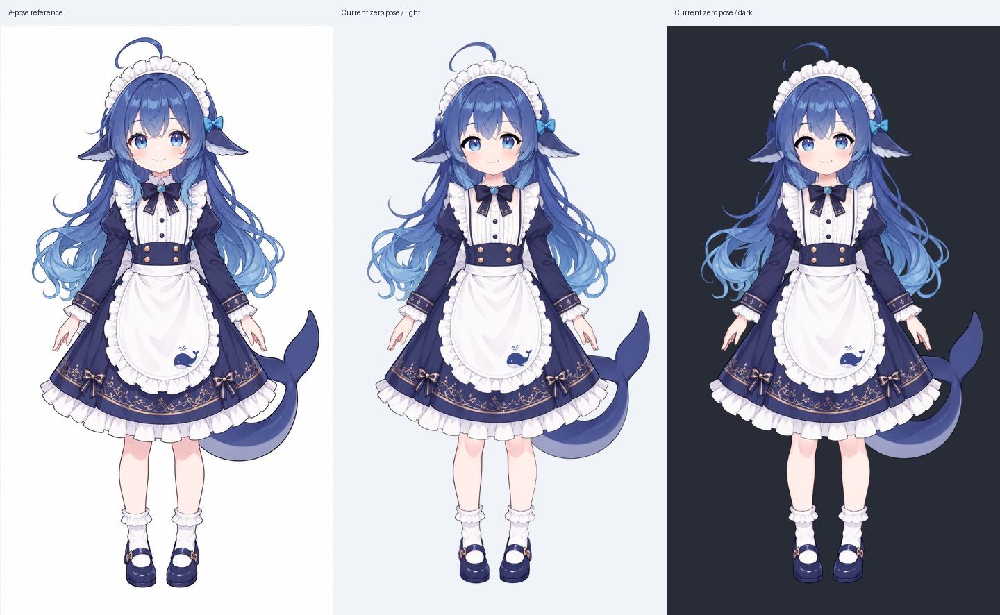
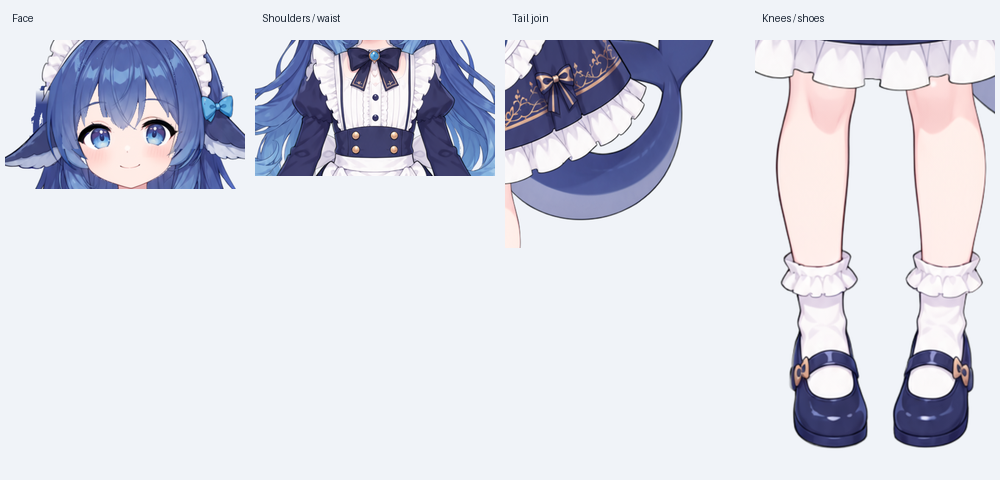
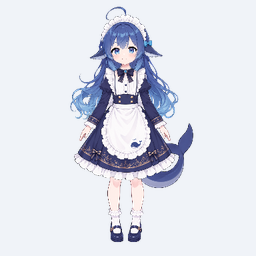
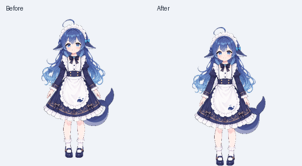
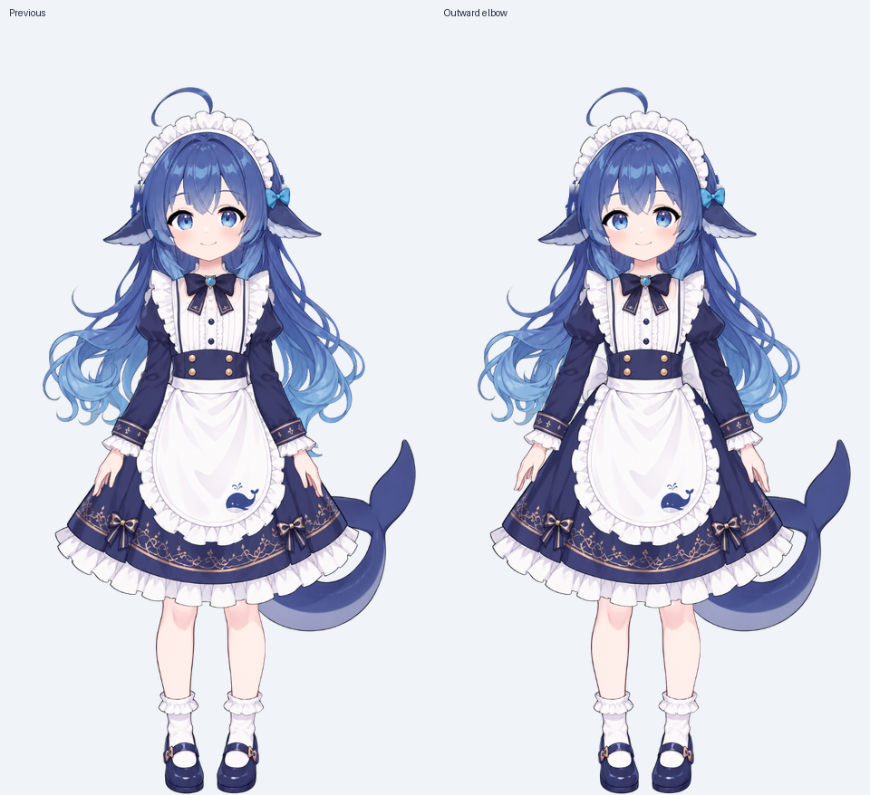
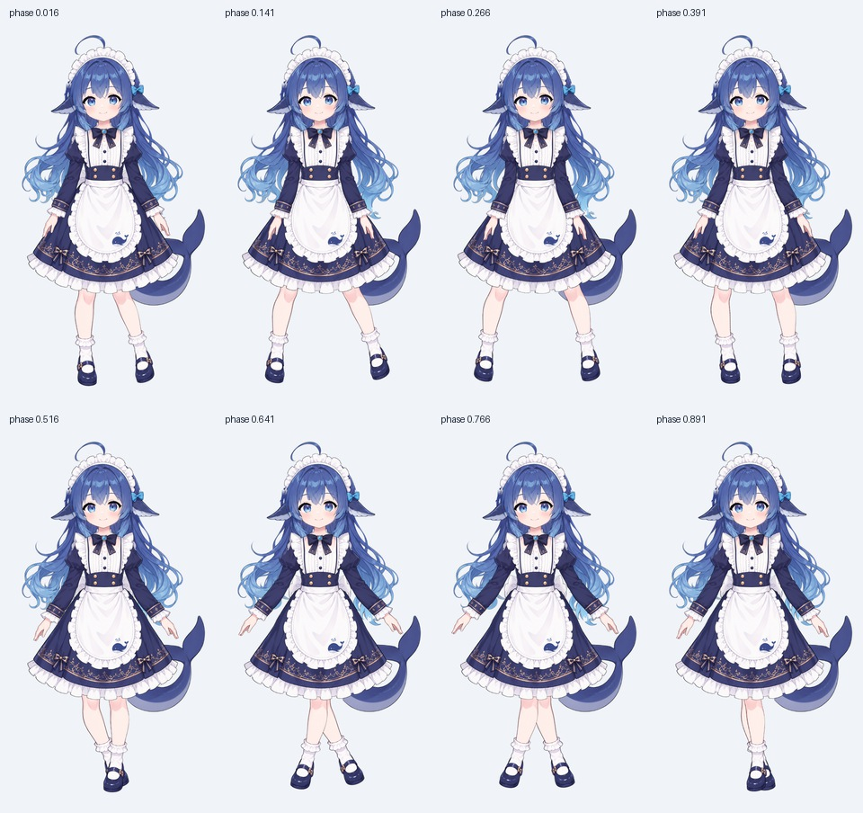

# ADULT 静态视觉审查与自然行走方案

审查日期：2026-09-25。对象是当前工作区的实际资产和代码，包含已有未提交修改。本文的行走诊断保留了站姿修复前的基线；同日已按用户要求实施静态站姿修复，详见第 2 节的修复结果。现有步态仍待下一阶段处理。

## 1. 结论

**静态整体基本自然，站立脚底与双臂放松姿态现已修复。当前行走仍不自然，不适合直接增加摆角后交付。**

角色头身比例、服饰颜色、长发轮廓和裙腿遮挡整体协调。静止时未见大面积透明裂缝或肢体脱接。脚底锚点和 A-pose 到放松站姿的偏置已经落地；后续重点是步态的运动学约束。

当前素材是正面视角。左右大腿采用反相平面旋转后，实际画面在“张腿—交叉腿”之间切换。新增关节不能凭空补出侧身的鞋面、手臂和服装透视。

建议采用两级方案：

1. **现有素材的可行版本：正面小步侧行。** 先迈行进方向的脚，再收拢后脚，脚不交叉；速度较低。可先验证锁脚和重心转移，资产成本较低。
2. **追求横向普通行走的最终版本：新增三分之四侧身行走绑定姿态，配合双腿 IK、支撑脚锁地和次级运动。** 保留正面站姿；转身后沿桌面前进。建议优先准备一侧素材，另一侧可先镜像，之后按非对称饰品需求决定是否制作独立另一侧。

这里所有新步态参数都是项目的调试起点，不是人体生理标准，也不是已经通过成品视觉验收的参数。

## 2. 实际检查范围与证据

加载路径：`assets/rig/adult/manifest.json` → `load_rig_spec()` 自动探测 `assets/rig_adult/` → `SkinnedMeshItem`。

| 项目 | 当前实测 |
| --- | --- |
| 骨架 / 图层 | 47 根骨骼 / 21 层 |
| 网格 | 2,043 顶点 / 3,116 三角形 |
| 源画布 | 960 × 1696 |
| 默认 ADULT 窗口 | 256 × 256，等比居中；ADULT 蒙皮增加脚底对齐偏移 |
| 蒙皮显示条件 | `healthy_neutral`；不能把这次结论直接推广到其他 figure |
| 检查方法 | 当前 Qt 硬件渲染路径重新抓图、浅深背景检查、源尺寸细节检查、64 个步态相位采样 |







### 静态自然度（原始审查与修复结果）

| 部位 | 判断与处理 |
| --- | --- |
| 头身、服饰与长发 | 整体协调，可沿用。拆层结果与参考图并非逐像素一致；脸、肩颈及部分头发已经重绘，但没有形成明显的整体风格割裂。 |
| 肩颈与双臂 | 原始姿态双臂外展；第一版过度向内收肘，手臂折线不自然。现已在 ADULT `rest_pose_angles` 中设置左/右上臂 +4°/−4°、前臂 −12°/+12°，肘部轻微向外、手沿裙摆两侧下垂；保留 bind pose 与袖口、裙摆间隙。 |
| 裙摆与膝部 | 零姿态搭接成立，腿的上端隐藏在裙内。摆腿后仍需要单独检查裙底露空和金线变形。 |
| 尾巴 | 静止轮廓基本连续。实际可见完整尾巴在 `tail_seg1`；`tail_seg2`、`tail_tip` 的 alpha 内容均只有约 4×4 像素、网格各 4 顶点，属于占位。因此“有三层文件”不能证明已完成三段独立拆件；完整尾层仍可由四骨蒙皮驱动。 |
| 脚底与落地 | 左右腿网格最低点约 y=1608/1607；修复前在 256 高窗口底部留白约 **13.3 px**。现以源图 y=1608 作为 ADULT 蒙皮的脚底锚点，渲染后最低鞋底像素到达窗口最后一行。 |
| 静止微动 | 修复前整身呼吸平移 ±2.5 像素并缓慢旋转。现 ADULT 接地静止时的整身呼吸平移、漂转与髋部微旋转为零，呼吸主要留在脊柱、胸部及头部。 |

修复后实机渲染：




用户反馈第一版收臂仍显怪异后，复核了现有 `upper_arm_l/r → forearm_l/r → hand_l/r` 关节链；其中 `forearm_l/r` 就是肘关节。比较六组肩肘姿态后，将肩肘方向改为轻微向外屈肘、双手贴近裙摆两侧。下图为第一版与修订版的同尺寸渲染：



此修复通过资产 `ground_anchor_y_px` 和 `rest_pose_angles` 配置驱动，仅在 ADULT 蒙皮可见时施加脚底偏移；YOUNG/其他图像显示路径不继承该偏移。并已检查左右镜像、浅深色背景以及约 3 秒的空闲姿态。

### 当前行走问题

以下截图保留了站姿修复前的行走基线，关闭了整体旋转、整体颠簸、眨眼和头发尾巴次级运动，只保留当时的四肢计算，便于定位步态自身的问题。它不是完整应用运行录像。



1. **运动方向不对应。** `upper_leg_l/r = 14° × sin(φ / φ+π)` 在正面图上主要产生外展和交叉。64 个相位中，鞋部网格平均中心的有符号横向间距从约 **+76.0 px 到 −39.9 px**（均换算到 256 高）；负号意味着左右鞋已经换边。
2. **没有接触约束。** `MotionInputs` 没有真实根位移、地面位置或接地状态，步频靠速度映射，不能消除支撑期脚滑。当前不能给出可信的“支撑脚滑动量”，因为代码根本没有标记支撑期。
3. **脚踝不补偿。** `foot_l/r` 角度固定为 0，表示局部不旋转，不表示鞋底在世界空间保持水平。鞋会继承大腿和小腿的旋转。
4. **权重过于分散。** 源图 y≥1490 的鞋部顶点，平均约 47% 小腿、47% 脚、6% 大腿权重。实现脚踝反向补偿后，鞋面仍会被小腿拉扯。裙摆的双大腿总权重平均约 21.3%，局部最高约 78.3%，腿部交叉会明显牵扯裙面。
5. **抬脚与身体起伏未由接触事件驱动。** 隔离四肢后，单腿最低网格点相对静止鞋底线变化约 −3.14～+0.32 px；这只能说明竖向摆幅，不能作为穿透地面或落地成功的正式判据。完整运行还叠加呼吸、整体旋转与颠簸。
6. **显示时间与行为时间分离。** 行为使用实际 dt；呈现器定时器每次固定推进 33 ms。卡顿、变速时会进一步造成动作和真实位移不同步。

## 3. 推荐运动结构

保留现在的 `MotionEngine → MotionFrame → Presenter → SkinnedMeshItem` 分工。新增 ADULT 专用的步态求解器，其他阶段继续使用各自配置。

```text
实际根位移、地面、朝向、角色缩放、接地状态、真实 dt
    ↓
起步 / 稳态行走 / 收步 / 转向 状态机
    ↓
左右脚接触计划 + 世界空间脚底目标
    ↓
骨盆重心与可达范围修正
    ↓
双骨 IK（髋—膝—踝）+ 脚底方向/脚尖支点
    ↓
胸肩反向微动、手臂摆动、头部稳定
    ↓
裙摆/围裙/后发/尾巴阻尼响应
    ↓
蒙皮与显示；接地脚不再被额外整体 bob/旋转移动
```

### 脚底先定住，再求关节

- 每只脚记录 `stance/swing`、接触点、接触时的世界位置、下一次落脚点。
- 支撑期锁定世界空间接触点：`F_world = constant`。角色窗口移动时，通过完整显示变换的逆矩阵计算模型空间目标，不能只减窗口 x；应包含 fitScale、居中留白、ground anchor、镜像和根节点变换。
- 根据鞋底接触标记与目标鞋角，反推踝点，再解两节腿。**踝关节不是脚底点**，不能直接把踝点钉在地上。
- 两腿长度从各自的实际关节位置计算，不强行假设左右完全相等。选择稳定的膝盖弯曲方向，避免 IK 解在两侧翻转。
- 当目标超出可达范围时，调整骨盆、缩短下一步或限制根速度。不能靠拉长小腿或静默钳角让脚脱离目标。
- 支撑期不对最终 IK 角度单独加弹簧；平滑的是目标、骨盆和步态状态，再解接触约束。
- 地面位置在渲染、窗口碰撞、脚底标记和阴影之间保持同一个约定。按当前图的起点可取 `ground_y≈1608/1696`，最终应使用可见鞋底标记标定。

### 周期与速度

“一周期”指同一只脚连续两次落地，两脚合计两步。普通行走初始采用支撑 60%、摆动 40%，左右相差半周期；双支撑区间自然产生在重叠部分。这是调试参数，需随速度调整。

- `S_cycle = abs(v_world) / f_cycle`；位移与频率不能各自随意设置。
- 支撑期在模型中的回退距离约 `abs(v_world) × 0.6 / f_cycle`，不是整个周期位移。
- 将速度、步长和抬脚高度统一换算到源图空间或角色高度比例，避免放大窗口后步态不匹配。
- 600 px/s 的默认跟随速度不能继续包装成普通走路。应限制 ADULT 自然行走速度，或者另设奔跑/快速移动状态；不能只提高摆腿频率而不增加合理步长和腾空过程。

### 摆脚曲线的连续性

支撑脚相对身体的速度为 `−v`。摆动段不能直接接一条两端速度为零的模型空间 smoothstep，否则离地、落地的世界速度不连续。

恒速原型使用以下构造，生产版本在变速时使用带端点位置、速度、加速度的五次 Hermite 曲线重新规划未接地的脚：

```text
u ∈ [0,1]，s(u)=10u³−15u⁴+6u⁵
A = v × T_stance / 2
m = −v × T_swing
x_local(u) = center − A + m×u + (2A−m)×s(u)
lift(u) = 64×H×u³×(1−u)³
```

水平方向两端导数匹配支撑期的 `−v`，竖向在两端的速度和加速度为零，减少脚突然弹起、砸落和相位接缝。

## 4. 当前正面素材：小步侧行的可行参数

动作次序是“先移重心 → 前导脚向行进方向迈出 → 转移支撑 → 后脚收拢”，不采用对称的张开/合拢循环。向左时交换前导脚并正确转换世界坐标。

运行 `spikes/prototype_adult_side_step.py`，使用当前关节长度，采样两个周期共 2,400 点，得到：

| 项目 | 原型值 / 结果，256 高显示空间 |
| --- | --- |
| 速度 / 周期频率 | 45 px/s / 1.1 周期每秒 |
| 抬脚高度 | 3.5 px |
| 两脚目标中心最小间隔 | 18 px，不发生交叉 |
| 两脚目标中心间隔范围 | 18.0～58.9 px |
| 为保证双腿可达的骨盆下沉 | 约 1.02～3.18 px |
| 支撑脚世界速度数值残差 | < 3×10⁻⁹ px/s |
| 双骨长度误差 | < 7×10⁻¹⁴ px |
| 脚踝反向补偿所需范围 | 约 −12.3°～+15.9° |
| 右膝局部角最大值 | 约 +26.4° |

这说明在较小速度下，**脚不交叉、脚不滑、腿长不变可以同时满足**。但当前脚踝限制 ±10°、右膝上限 +10°会阻挡该解，需要根据左右膝的弯曲约定修改 ADULT 限制；不能只接入 IK 后继续使用旧钳制。

该原型仅验证脚目标和理想双骨几何，**尚未验证现有蒙皮、鞋宽碰撞、视觉表现、启停或转向**，不应把数值残差当作真实渲染已经不滑的证明。脚中心间隔也不等同于鞋子轮廓间隔，后续仍需检查完整鞋形。

## 5. 最终横向普通行走：三分之四侧身版本

### 资产与站姿

准备一套朝行进方向的三分之四视角资产，至少保证头颈、胸腰、裙摆、手臂、双腿和鞋面的视角一致。沿用同名骨骼和动作语义，关节位置必须按新画面重新标定。

- 行走基准姿态双臂自然下垂，肘部轻屈，肩膀放松。
- 裙内大腿虽然不可见，也要保留完整髋—膝长度和必要的遮挡补全。
- 前后腿使用稳定的远近图层关系，避免每半周期硬换 z-order 造成闪烁。正面侧行则保持左右身份与轮廓间隙。
- 正面站姿与侧身步态的过渡应对齐骨盆、头部和脚底；先验证转身姿态，再决定是否使用短时混合，避免两套轮廓透明重影。

### 单脚动作节奏

| 单脚局部相位 | 目标行为 |
| --- | --- |
| 0–10% | 鞋底接触并承重，膝与骨盆轻微缓冲；不叠加全身落地 squash |
| 10–45% | 稳定支撑，身体越过支撑脚，脚底保持世界位置 |
| 45–60% | 逐渐提踵，接触支点转向前脚掌，准备离地 |
| 60–80% | 小腿折起、脚尖留出地面间隙，脚向前通过 |
| 80–100% | 逐渐伸腿并减小鞋角，落脚前速度收敛，与下一支撑期连续 |

起调幅度：抬脚高度约角色显示高的 1–2%；骨盆竖向变化约 0.5–1%；胸肩相对骨盆反向转动约 0.5–1.5°；手臂基准姿态附近摆动约 4–7°，肘约 3–6°，腕约 1–3°。这些必须在新视角下调试，不能直接当作现有正面素材的旋转值。

骨盆起伏由腿的可达性和支撑转换决定，头部用颈部轻微反向补偿保持稳定；不能在 IK 完成之后再给整个人叠加无约束的上下漂移。

## 6. 关节增补与蒙皮

现有髋、膝、踝已经足够完成双骨 IK；先完成接触求解，再增加对视觉有实际作用的关节。

| 增补 | 数量 | 父级与用途 |
| --- | --- | --- |
| `toe_l/r` | 2 | 接在 `foot_l/r` 下，三分之四视角下实现前脚掌支点与鞋尖折转；正面侧行先保持小幅 |
| `clavicle_l/r` | 2 | 接在 `chest` 下，原 `upper_arm_l/r` 改挂相应锁骨，肩部承重和手臂惯性更自然 |
| `skirt_mid_l/r` | 2 | 接在 `skirt_root` 下，现有左右 `skirt_hem` 改挂相应中段，分离腰部固定区和裙缘摆动 |
| `skirt_hem_c` | 1 | 接在 `skirt_root` 下，控制前裙下缘，小幅响应步态并限制图案变形 |
| `apron_mid` | 1 | 插入 `apron_root → apron_tip`，让围裙上部稳定、下部滞后 |

完整增补后为 55 骨。可另加一个无贴图权重的 `motion_root` 统一全身落地变换，届时为 56 骨；也可以暂时保留为求解器逻辑变换。左右 heel/sole/toe 接触点是标记，不必都增加为变形骨骼。

新增骨骼必须同时更新 spec、父链、网格顶点密度、蒙皮权重和测试契约，不能只在角度字典里加名称。

蒙皮调整顺序：

1. **脚：** 小腿与鞋在踝部有连续过渡，鞋底和主要鞋面以足骨刚性权重为主，前掌区域再交给 toe；不要让大腿直接影响鞋头。若不拆鞋层，也需重画当前 leg 层的权重。
2. **腿：** 膝附近增加横向顶点环，只允许相邻骨骼过渡；左右分开，裙内补全区有足够搭接。保留弯曲内侧面积，防止 LBS 把膝盖压瘪。
3. **裙：** 腰口固定到骨盆/裙根，去除大腿对大面积裙面的直接高权重。腿部接近裙缘时通过低权重姿态修正或接触目标影响裙摆，不能让每条腿硬拉半边裙子。
4. **臂：** 肩口固定区与胸部搭接，新增锁骨后重画胸—肩—上臂权重；手掌大部保持刚性，袖口不被前臂和手掌拉成橡胶。
5. **图案：** 腰扣、鲸鱼图案、裙摆金线设置保护区域，局部扩网格不等于允许任意伸缩。

## 7. 次级运动与过渡

| 部件 | 驱动来源与起调方式 |
| --- | --- |
| 后发 | 躯干加速度及转身角速度驱动，沿发链逐段衰减/滞后；限制源图边缘和肩部穿插 |
| 尾巴 | 骨盆的侧向加速度与转向带动，保持现有四骨链；步态驱动叠加小幅独立微动，避免与手臂完全同相 |
| 裙摆 | 重心转移和腿部接近裙缘带动，先调 1–3°小幅；腰口基本不动 |
| 围裙 | 上端固定、下端滞后，振幅小于裙摆，鲸鱼图案不随整片拉伸 |
| 头部 | 反向抵消一部分胸部摆动，注视方向转换后仍以屏幕目标为准 |

使用当前弹簧框架作为基础。阻尼、频率按 ADULT 单独配置；“相位延迟 60–150 ms”可作为视觉调试目标，但不要在同一条链上同时硬加延迟和过大的弹簧滞后。

- 起步：约 80–120 ms 重心预备，确定第一只摆动脚，不能从空闲期间随机累加的相位直接进入。
- 停步：完成当前摆动脚的收步，再用约 200–350 ms 回到放松站姿。若行为层已经立即停住，收步目标要基于停止后的根位置重算，不继续假设根在前进。
- 转向：减速、进入双支撑附近、重建朝向后的脚身份和目标，再迈步；不能对仍锁在地面的脚直接整体镜像。
- 碰撞/下落/拖拽：退出地面步态，清理旧锁脚状态；真正落地后重新标定接触点，再恢复走路。
- 低速接近零时先收步，避免 `walking=True` 但速度为零仍原地摆腿。

## 8. 对应代码改动与实施顺序

| 文件 | 建议改动 |
| --- | --- |
| `pet/rig/spec.py`、`assets/rig_adult/spec.json` | 增加并解析 ADULT 的 ground anchor、步态参数、接触标记、基准站姿、关节限制；仅往 JSON 加字段不会自动被运行期读取 |
| 新 `pet/rig/gait.py` | 独立的接触状态机、落脚规划、骨盆修正、双骨 IK；使用纯数据接口便于验证 |
| `pet/rig/motion.py` | 扩展 MotionInputs 的位移/速度/地面/缩放/grounded 输入；ADULT 分支调用新求解器；接地期间把整体呼吸改为上半身微动 |
| `app.py`、`pet/rig/presenter.py` | 传递行为层实际位移与接触信息；呈现器采用单调时钟的真实 dt；明确求解器与行为层各自负责的位置，避免两次推进根位移 |
| `pet/rig/rig_scene.qml` | 接地 ADULT 的全局旋转/颠簸不能绕过锁脚解算；消除 bodyAngle 的额外滞后对接触点的二次移动；保留其他阶段和空中路径 |
| `tools/mesh_generator.py` | 增加关节区采样及按部位约束权重，避免通用距离权重贯穿整条腿和裙子；重新生成 ADULT 网格 |
| `pet/rig/skinned_mesh_item.py` | 现有动态骨骼数量及局部角/平移接口可复用；只有确需姿态修正形变时才扩展通道，不为了走路重写渲染内核 |
| `spikes/test_skinned_mesh_adult.py` | 更新硬编码 47 骨契约；把 `abs(lower_leg_angle)>=0` 这类恒真检查换成可达性、接触误差和实际变化断言 |

实施顺序：

1. **已完成：**修正 ADULT ground anchor 和放松站姿，确认 256 尺寸真正贴地。
2. 先完成现有素材的低速侧行接触原型，隔离头发、尾巴和眨眼验收脚步。
3. 重做脚/膝/裙权重，按需要加入足尖与衣物关节，验证最大姿态。
4. 制作三分之四视角，重标定同名关节，加入普通行走与转身过渡。
5. 接入实际速度、启停、转向和帧间 dt，再恢复全部次级运动。
6. 最后调整渲染频率：可测试运动时 60 Hz、静止时 30 Hz；求解可用固定小步长和累计时间。插值后仍需保持接触约束。先测 CPU、内存和帧耗时，再决定默认值。

## 9. 成品验收标准

以下是拟定的验收阈值，不代表本次已通过：

- 在 256 高显示下，单次完整支撑期的脚底世界位置漂移 ≤0.5 px，接触点穿地 ≤0.5 px；测量包含窗口移动、镜像、QML 变换、蒙皮结果。
- 正面侧行时双脚轮廓不交叉；三分之四行走允许合理投影重叠，但前后遮挡稳定。
- 一周期接缝的位置和速度连续，启停无明显单帧跳变；30/60 Hz 以及不均匀 dt 下步速一致。
- 鞋底不扭曲、膝盖不突然反折，裙口、肩口无新增透明裂缝，裙摆与围裙图案不被明显拉长。
- 静止和走动时均检查浅色/深色背景，256/384/512 显示尺寸，左/右方向，以及高 DPI。
- 检查低速起步、正常步速、速度上限、急停、反向、到达边缘、被拖起后落地、YOUNG↔ADULT 切换。
- 性能采用目标机器实测帧耗时和稳定运行结果，不能以纯 NumPy 解算速度代替整个 Qt 窗口的帧率。

## 10. 本次产出与复现

```powershell
D:\anaconda3\python.exe -X utf8 spikes/qa_adult_review.py
D:\anaconda3\python.exe -X utf8 spikes/prototype_adult_side_step.py
```

- `spikes/_qa/adult_review/metrics.json`：实际骨架/网格信息、鞋底留白、当前64相位的脚部数据。
- `spikes/_qa/adult_review/current_walk_isolated.gif`：当前四肢的慢放观察图，每帧30 ms；并非真实时间应用录像。
- `spikes/_qa/adult_review/side_step_feasibility.json`：新侧行脚目标的几何可行性结果。

本次已验证当前资产可在 Qt 硬件路径渲染，已检查关键截图并完成 ADULT 静态站姿修复；低速侧行目前仅验证脚目标与双骨几何，尚未实现成品行走动画。
