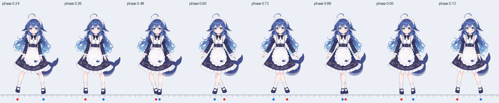
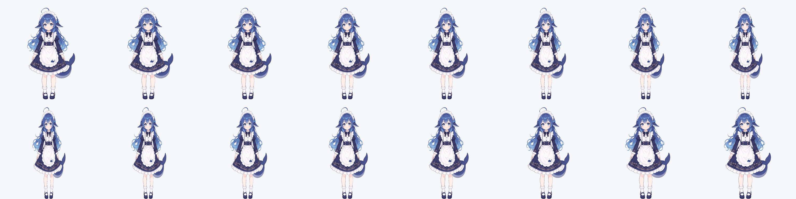
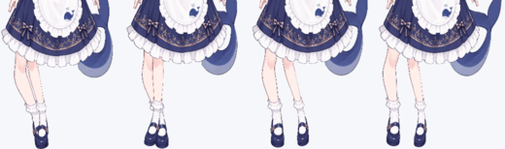
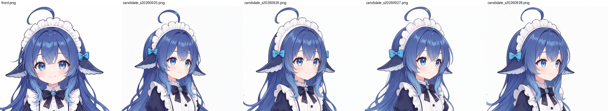

# ADULT 转身视频过渡 + 侧身骨骼行走实施方案

日期：2026-09-27　状态：**方案待双方确认**（尚未生成任何视频或侧身原画，尚未改动产品代码）

范围：ADULT `healthy_neutral` 的"正面待机 → 转身 → 行走 → 停步 → 转回正面"。其他 figure、其他阶段保持现状。

前置文档：`docs/ADULT视觉审查与自然行走方案-2026-09-25.md`、`docs/ADULT连续视角与横向行走执行计划-2026-09-25.md`、`docs/ADULT步态计算核实现记录-2026-09-25.md`、`docs/2D骨骼蒙皮动效全栈工作流规范.md`。

本方案**取代**连续视角计划中"全身视角关键形态"路线（原 G1–G3）；步态计算核 `pet/rig/gait.py` 保留并复用到侧身骨骼上。

---

## 0. 一页结论

| 项目 | 结论 |
|---|---|
| 正面静止（待机） | 自然，保留现有正面蒙皮骨骼（21 层 / 47 骨）。 |
| 现有行走 | 不自然，而且**调参修不好**。正面图上腿只能在画面平面内转动，得到的是外展和交叉；而走路时腿的前后摆动在正面视角里几乎全是纵深方向。 |
| 连续视角关键形态（GLM 卷） | 数学核可复用，但全身 0→45° 形变需要大量手工美术配准。目前唯一的渲染结果是把正面图横向压扁，不是转身。停止该路线的全身部分。 |
| 新架构 | **正面骨骼（待机）⇄ 转身视频片段（绿幕抠像）⇄ 侧身骨骼（行走 / 侧身待机）**。循环动作交给骨骼，一次性的"转出画面"旋转交给视频。 |
| 明确不做 | 生成式行走循环（已实测：模型理解不了精确角度，动作僵硬怪异）；全身连续视角形变；3D 化。 |
| 视频模型 | Seedance 2.0 不是唯一最优。**先做同条件选型评测**（Vidu Q3 Pro / Seedance 2.0 / Kling 3.0 / 海螺 3），按第 5 节门禁打分后再定。 |

---

## 1. 现状诊断（证据）

复现命令（仓库根目录）：

```powershell
& D:\anaconda3\python.exe -X utf8 spikes/qa_adult_walk_diagnosis.py
& D:\anaconda3\python.exe -X utf8 spikes/qa_green_key_feasibility.py
```

证据目录：`spikes/_qa/adult_walk_v1/g0_diagnosis/`

### 1.1 生产链路实况

- ADULT 的加载路径是 `assets/rig/adult/manifest.json` → 自动探测 `assets/rig_adult/`（**没有** `gait` 段）→ `pet/rig/motion.py` 中 `_compute_bone_poses` 的正弦摆腿。
- `app.py` 从未调用 `set_gait_command`，GLM 的步态求解器在生产中**没有生效**；`assets/rig_adult_turn_v1/` 只是实验包。
- 窗口位置由 `app._tick` 每 50 ms（20 Hz）调用 `move_bottom_center` 更新；骨骼姿态由呈现器 33 ms（约 30 Hz）的定时器推进。**两个时钟不同步**，无论用什么动画方法，锁脚都会被打破。

### 1.2 静止：自然


贴地，整体不漂移；呼吸只留在躯干；眨眼、注视、发/尾/裙弹簧在 256 px 下观感良好。

### 1.3 行走：不自然

真实 Qt 硬件渲染，按 `config.json` 的 `walk_speed = 120 px/s`（`walk_hz = 0.9 + v/400 = 1.2`）驱动，窗口在桌面上同速移动：



| 指标（256 显示像素） | 实测 | 含义 |
|---|---|---|
| 两鞋中心横向间距（右减左） | +76 → −40 px | 双脚在画面内换边（交叉） |
| 鞋在桌面上的速度 | −91 ~ +361 px/s（窗口 120 px/s） | 脚在地面上前后乱滑 |
| 鞋速绝对值 < 12 px/s 的帧占比 | 左脚 0%，右脚 8% | 从未真正踩住地面 |

**根因是投影几何，不是参数。** 走路时腿在身体的矢状面内前后摆动；正面视角下这个平面几乎垂直于屏幕，2D 平面内旋转只能做出"外展/内收"这个错误方向的运动。IK、锁脚、调幅度都改变不了这一点（正面只可能做"侧向小碎步"）。手臂同理，看起来像开合跳。

### 1.4 连续视角关键形态路线的问题

- 渲染出的"45° 转身/行走"其实是正面贴图横向压扁：脸仍然正对镜头、双眼对称；腿部线稿因压缩断成虚线；交叉帧里两只鞋粘在一起。

  

  

- 28/28 数值门禁通过，但这些门禁只测数学不变量，不测"看起来是否在转身"。**教训：之后每个门禁都必须同时有数值指标和人工目检签字。**
- 真要做成，需要在各自独立绘制的视角图之间建立稠密对应、为所有新露出的面画补片、处理头发和手臂的层序切换。对 ±15° 的头部转动可行；对带长卷发、荷叶边和尾巴的全身 45° 转身不现实。
- AI 生成的 4 张右 45° 候选**全部**把蝴蝶结画到了近侧（它应在角色自身左侧，即面向右时的远侧），其中 s20260926 两侧各有一个：

  

### 1.5 本角色配色的抠像可行性

把正面蒙皮渲染合成到 #00B140 绿幕，按 1080×1920、H.264 4:2:0（CRF 18 / 28）编码再解码，用普通色差抠像加去溢色，与真值 alpha 比较（`green_key_metrics.json`）：

- 不透明像素里色相接近键色（±40°）的占比为 **0%**；G − max(R, B) 的最大值只有 3/255。绿色不会误伤角色。蓝幕（头发、裙子）和白底（围裙、荷叶边）都不可用。
- 256 显示下，约 1.5 万个不透明像素里 alpha 误差 > 0.1 的只有 56–73 个；残余绿色为 0。
- 这是理想情况下的误差下限。真实生成的视频还会有绿幕不均、地面阴影、运动模糊和边缘噪声，需要抠像模型处理（见 4.3）。

### 1.6 约束

- **内存**：mac 端 30 分钟浸泡（2026-09-23）稳态中位 176 MB、P95 223 MB，P95 已超 200 MB 红线（见 `内存优化A-B对比-2026-09-23.md`）。新增侧身骨骼加片段帧估计 +25~40 MB，必须实测。
- **左右命名**：spec 按**画面侧**命名。`_l` = 正面图的画面左侧 = 角色自身右侧；`_r` = 画面右侧 = 角色自身左侧（蝴蝶结挂在 `ear_fin_r` 上）。侧身骨骼**沿用同名骨骼表示同一身体部位**，因此角色面向右时，`_r` 系列（角色左侧）是远侧。
- **拆层不是逐像素复制**：正面骨骼的静止渲染与其 960×1696 原画相比，256 显示下平均差 5.7/255、P99 47.9/255（脸、肩颈、部分头发经 Qwen 重绘）。所以**片段首尾帧必须用骨骼的实际静止渲染**，不能用原画。

---

## 2. 新架构

```text
                    行为层给出行走意图
                            │
  ┌──────────────┐  settle ≤250ms  ┌──────────────┐  两端各淡化 2~3 帧  ┌─────────────────┐
  │ 正面骨骼      │ ──────────────→ │ 转身片段       │ ──────────────────→ │ 侧身骨骼          │
  │ 待机 / 互动   │ ←────────────── │ 绿幕抠像帧     │ ←────────────────── │ 起步/行走/停步    │
  └──────────────┘                 └──────────────┘        settle        │ 侧身待机          │
                                                                          └─────────────────┘
  向左：整体水平镜像（与 YOUNG 一致）；行走途中反向：侧 → 正 → 镜像侧（v1）
```

分工原则：

- **骨骼**适合循环、可参数化、需要实时响应的动作：待机、行走、停步、注视、眨眼、弹簧次级运动。
- **视频**适合一次性、转出画面平面的旋转，也就是转身。视频模型对遮挡变化、远侧眼睛出现、头发和尾巴绕身体甩动有三维一致性；片段又短（0.5–0.8 s），细节闪烁来不及被看出来。
- 侧身视角下腿和手臂的前后摆动基本在画面平面内，2D 旋转加 IK 在物理上成立，`gait.py` 的接触锁定与 IK 到这里才真正有意义。

关键设计决定：

1. **侧身骨骼不从视频帧拆**。视频帧是 720p/1080p 有损压缩，清晰度远低于 960×1696 原画。先做**干净的高清侧身关键原画**，骨骼和视频尾帧都以它为准。
2. **转身片段首尾双钉**。首帧 = 正面骨骼静止渲染，尾帧 = 侧身骨骼静止渲染，用视频模型的首尾帧模式生成，片段两端与骨骼画面天然一致。
3. **参考图第一优先，文字只做补充约束**（2026-09-27 双方确认的原则，适用于所有图像与视频生成）。实测参考图远比文字可靠：只靠文字时角度不准、饰品换边。每次生成前先决定喂哪些图——身份参考（骨骼静止渲染）、姿态/角度参考（提案视频尾帧或已修正的候选图）、首尾帧、要照抄的饰品局部裁图——提示词以"图 1 = …，图 2 = …"指向这些图，不用文字描述角度和细节。发现参考图本身有错（如候选图蝴蝶结换边）时，先修参考图，再用它生成。
4. **不要求模型理解精确角度**。侧身角度完全由姿态参考图给出，不用文字写度数。
5. **转回正面单独生成一条**（首帧 = 侧身静止，尾帧 = 正面静止），不用倒放；倒放时头发会先于身体动。

---

## 3. 制作流水线

### 3.1 目录约定（新建，不触碰生产包 `assets/rig_adult/`）

```text
assets/rig_adult_walk_v1/
  references/gpt_raw/        gpt-image 原始输出（全部保留）
  references/proposals/      转身提案视频的尾帧（姿态参考）
  references/side_key.png    定稿侧身关键原画，960×1696 RGBA
  references/side_key.json   生成记录：模型、提示词、种子、输入哈希、修复步骤
  prep/  layers/  mesh/  spec.json          侧身骨骼（沿用现有工具链）
  clips/turn_front_to_side/  clips/turn_side_to_front/   定稿帧 + clip.json
spikes/_qa/adult_walk_v1/g{N}_*/            各门禁证据
```

原始视频与大体积候选不入库；只入库定稿帧、生成记录和门禁证据。

### 3.2 执行顺序

```text
G0 基线 ──→ G1 侧身关键原画 ──┬──→ G2a 视频选型评测（尾帧暂用关键原画）──────────┐
                              └──→ G4 侧身骨骼 ──→ 侧身静止渲染 ──→ G2b 定稿生成 ──┴──→ G3 抠像后处理 ──→ G6 集成 ──→ 最终验收
                                               └──→ G5 侧身行走 ───────────────────────────────────────┘
（G3 流水线可以在 G0 之后，用本地 Wan 2.2 加旧候选图作尾帧先行打通，零成本）
```

### G0 基线冻结

1. 渲染正面**放松静止姿态**：`rest_pose_angles` 生效、其余骨骼为 0、睁眼、注视居中、弹簧静止、呼吸为 0，输出 960×1696 RGBA。它既是转身首帧的来源，也是运行时 settle 的目标姿态。注意：`spikes/qa_adult_review.py` 里的 rest 是全 0 的 A-pose，不是这个姿态。
2. 记录资产哈希和测试基线（`test_skinned_mesh_adult`、`test_stage_switch`、`test_skinned_mesh_rig`、`test_v13_rig`、`test_v14_paperdoll`），已知存量失败单独列出。
3. 给 `tools/crop_and_prep.py`、`tools/batch_qwen_layers.py` 增加 `--ref/--spec/--out` 路径参数。它们现在把 `assets/rig_{stage}` 写死，直接跑会覆盖生产图层。

负责：Claude。门禁：5.2 G0。

### G1 侧身关键原画

- **路线 A（推荐）**
  1. 用正面静止渲染（绿幕、9:16）生成 2–3 条**只给首帧**的转身提案视频（选型评测里的一两个模型即可，提示词见附录 A3-0）。目的有两个：得到一个三维上自洽的侧身姿态；验证"连续旋转能否保住饰品归属"（这是假设，需要实测）。
  2. 选一条提案的尾帧作为姿态参考。gpt-image-2.5 以正面渲染为身份参考、以该尾帧为姿态参考，生成 4 张侧身原画（附录 A1）。
  3. 选定 1 张 → Qwen-Image-2.1 本地局部修复蝴蝶结、尾巴、手、鞋（附录 A2）→ 脚本对齐到 960×1696 画布（只允许等比缩放和平移，按脚底线 y = 1608 与身高对齐）。
- **路线 B（备选）**：跳过提案视频，直接用 `assets/rig_adult_turn_v1/candidates/right45/` 中姿态最好的一张作为姿态参考。
- **角度目标**：四分之三侧面到接近纯侧面，目测约 50–65°（远侧眼睛仍可见，胸前与围裙斜向可见）。不追求精确度数。
- **站姿要求**（为拆层和行走服务）：双脚平放在同一地面线上；两腿之间有可见间隙；手臂与身体之间留小缝；手自然放松；闭口微笑；睁眼。

负责：gpt-image-2.5 生成；Qwen 修复；Claude 对齐与自动检查；双方目检签字。

### G2 转身片段

**G2a 选型评测**

- 输入：首帧 = G0 正面静止渲染；尾帧 = G1 侧身关键原画。两者都合成到 #00B140 纯绿背景，补成 9:16（960×1696 上方补 11 px 成 960×1707，再等比缩放到模型分辨率），并记录画布映射。
- 设置：每个候选模型各 3 次（固定并记录 seed / task id），同一提示词（附录 A3），时长 4–5 s，分辨率取模型支持的最高档（不超过 1080p），**关闭音频**，24 fps。
- 打分：脚本先算 5.2 节 G2、G3 的自动指标 → 未淘汰的片段可交 Gemini 按附录 A4 预筛 → 双方在 256 px、1× 与 1/4× 速度、浅/深背景下目检，选出模型。

**G2b 定稿生成**（G4 完成后）

- 尾帧换成**侧身骨骼的实际静止渲染**（原因见 1.6），用选定模型生成"正→侧"片段；再交换首尾生成"侧→正"片段。

负责：你们调用付费 API；Claude 写端点准备、评测与打分脚本。

### G3 抠像与片段后处理

Claude 实现 `tools/process_turn_clip.py`：

解码 → 按记录的映射配准回 960×1696 画布 → 抠像（BiRefNet 逐帧，用首尾帧的已知 alpha 校验；时序闪烁超标时改用 MatAnyone 2，以首帧真值 alpha 作初始掩码）→ 去溢色 → 与骨骼渲染做颜色匹配（每条片段只允许一个全局颜色变换）→ 地面线稳定（对齐脚底行）→ 重定时（裁掉静止段，动作段压到 0.5–0.8 s）→ 预乘 alpha 缩放到显示尺寸 → 打包为 WebP/PNG 序列 + `clip.json`（fps、帧数、画布映射、地面线、每帧根位移）。

### G4 侧身骨骼（静态）

- **拆层**：沿用工作流规范第三节（`crop_and_prep` → `batch_qwen_layers`），输出到 `assets/rig_adult_walk_v1/`。Qwen 提示词照搬现有 `ADULT_PROMPTS` 的写法：提取主体、删除其余、向遮挡区补全 15–30 px、输出透明 RGBA。
- **图层草案（由后往前）**：尾巴 → 后发 → 远侧耳鳍与远侧蝴蝶结 → 远侧手臂（`arm_r`）→ 远侧腿（`leg_r`，大腿补全到髋）→ 近侧腿（`leg_l`）→ 裙 → 躯干 → 围裙 → 近侧手臂（`arm_l`）→ 脸/眼/嘴 → 侧发/刘海 → 近侧耳鳍 → 头饰/呆毛。建议把拆层与骨骼拓扑草案交 GPT-6 Astra 复核一次（附录 A5）。
- **骨骼**：沿用 47 骨的命名与父子关系，关节按侧身画面重新标定；腿部增加 `toe_l/r`（前掌支点）；裙摆按需增加 `skirt_hem_front/back`；接触标记 heel / sole / toe 只是标记，不是变形骨。
- **网格与权重**：`mesh_generator.py --spec/--layers/--out`；鞋以足骨刚性为主，踝部过渡；裙面对腿骨的权重上限 0.3；鲸鱼图案和金线设保护区。

负责：Qwen 拆层；Claude 标定、网格、权重与门禁；Astra 复核拓扑一次。

### G5 侧身行走

- 把 `gait.py` 的求解器对接到侧身骨骼：单视角，`view_yaw` 固定，不再做关键形态插值；接触标记和腿长从新 spec 读取。
- 行走参数满足 `速度 = 步频 × 周期步幅`。256 高下默认 120 px/s，对应步频约 1.0–1.2 周期/秒，周期步幅 100–120 px（约 0.4–0.47 个身高），偏"小碎步"的可爱风格，最终以目检为准。
- 起步：先移重心（80–120 ms）再迈第一步。停步：完成当前摆动脚后收步，200–350 ms 内回到侧身静止。
- 次级运动：后发、尾巴、裙摆、围裙由骨盆加速度驱动的弹簧带动，振幅从小起调。

负责：Claude。

### G6 运行时集成

- **状态机**（呈现器新增）：`FRONT_IDLE → SETTLE → TURN_CLIP → SIDE_START → SIDE_WALK → SIDE_STOP → SIDE_IDLE → SETTLE → TURN_BACK_CLIP → FRONT_IDLE`；拖拽、下落可以从任意状态打断。
- **两套骨骼**：同时驻留，或首次行走时懒加载（按内存实测结果定）。片段帧用独立图层播放，与蒙皮共用同一画布映射。
- **现有 QML 的一个坑**：`skinnedGroundShift` 只在 `skinnedMeshVisible` 为真时生效。如果片段走 figA/figB 那条路径播放，ADULT 画面会竖直跳约 13 px（256 窗口）。片段图层必须显式套用与蒙皮相同的 fit 和 groundShift。
- **单一时钟**：ADULT 侧身行走期间，窗口 x 由呈现器的动画拍（行走时 60 Hz）与姿态同帧提交；行为层 FSM 只给意图（目标、速度），并从窗口回读位置。拖拽、下落、攀爬等其他模式暂不改动。
- **行为层**：转身期间窗口不动，转身结束后才开始位移。侧身待机超时（建议 3–8 s）或用户交互时的处理见第 8 节待决策项。
- **回退**：增加配置开关（如 `adult_locomotion: "legacy" | "side_rig"`）；资产缺失时自动回退旧路径。

负责：Claude；GLM / DeepSeek 可做代码审查（附录 A6）。

### 3.3 文件任务清单（均由 Claude 实现，除非另注）

| 阶段 | 文件 | 内容 |
|---|---|---|
| G0 | 新 `tools/render_rig_rest.py` | 任一骨骼包的放松静止渲染（RGBA，源画布分辨率） |
| G0 | `tools/crop_and_prep.py`、`tools/batch_qwen_layers.py` | 增加路径参数，禁止默认写入生产包 |
| G1 | 新 `tools/align_side_key.py` | 等比缩放 + 平移对齐画布、脚底线、身高；输出 G1 数值检查 |
| G2 | 新 `tools/prepare_video_endpoints.py`、`spikes/qa_turn_clip.py` | 首尾帧绿幕 9:16 输入与映射记录；G2 指标、对照图、慢放 |
| G3 | 新 `tools/process_turn_clip.py` | 配准、抠像、去溢色、调色、稳定、重定时、打包 |
| G4 | 侧身 `SIDE_PROMPTS`、`spikes/qa_side_rig.py` | 拆层提示词；静止复原、极限姿态裂缝、权重检查 |
| G5 | `pet/rig/gait.py` 对接、`spikes/qa_side_walk.py`、`spikes/test_side_walk.py` | 网格级锁脚测量、起停、时间一致性 |
| G6 | `pet/rig/presenter.py`、`pet/rig/rig_scene.qml`、`app.py`、`spikes/test_adult_locomotion.py` | 状态机、片段图层、单时钟、场景脚本与回退 |

---

## 4. 模型与工具选型

### 4.1 视频模型：Seedance 2.0 是不是最优？

不是唯一最优。最初提它，是因为你点了名，它满足"首尾帧双钉"这个硬需求，而且国内可用（火山方舟）。截至 2026-09 下旬检索：

- Artificial Analysis 图生视频榜（无音频）排在前面的是 Gemini Omni Flash、Wan 3.0、Bach 1.0 Pro、MiniMax H3（海螺 3）、PixVerse V6，前五名只差约 30 Elo。Seedance 2.0 在 6 月曾居首，现在只出现在"带音频"榜的前五。
- 这些榜单测的是通用（多为写实）提示词，**不测首尾帧贴合度，也不测二次元画风保持**。本任务的硬条件按重要性排序：
  1. 首尾帧双钉（必须）；
  2. 保持二次元线稿与平涂，不"3D 化 / 写实化"；
  3. 饰品、图案跨帧不漂移；
  4. 原地转身、固定机位、双脚接地；
  5. 纯色背景全程不变、无阴影；
  6. 9:16、至少 720p、国内可调用。
- 榜单最前的两个都不满足第 1 条：Wan 3.0 经 API 只支持首帧；Gemini Omni Flash 没有命名的首尾帧字段，只能按顺序传两张图、以对话方式编辑（有评测把它列为不支持标准首尾帧接口）。

| 候选 | 首尾帧 | 时长 / 分辨率 | 看点 | 国内可用 |
|---|---|---|---|---|
| **Vidu Q3 Pro**（生数） | 支持（start-end） | 1–16 s，最高 1080p（API 至 2K） | 动漫向，评测称能保持平涂与干净线稿；快动作较弱，但转身是慢动作 | 是 |
| **Seedance 2.0**（字节） | 支持（first_frame / last_frame） | 4–15 s，480p–1080p，另有 4K | 通用质量强、时序稳定；首尾帧模式不能再叠加参考图 | 是（火山方舟） |
| **Kling 3.0**（可灵） | 支持，仅单镜头模式 | 3–15 s，720p | 动作自然 | 是 |
| **海螺 3 / MiniMax H3** | 支持 | 5–15 s，最高 2K | 当前榜单前列 | 是 |
| **Veo 3.1**（Google） | 支持（Flow 的 Frames to Video：首帧 / 首尾帧，任意画幅） | 4 / 6 / 8 s，最高 1080p（1080p 需 8 s） | 首尾帧控制最明确；**你的 Google AI Pro 已包含**：Flow 网页版每月 1,000 积分 + 每日 50 积分，Lite 10 / Fast 20 / Quality 100 积分一条 | 是（你们已有账号，网页手动操作） |
| Gemini Omni Flash 1.1（Google） | Flow 网页版支持"起止帧"（无 API 命名字段） | 4–10 s，360p / 720p | 当前图生视频榜首；同样包含在 Google AI Pro 的 Flow 中 | 是（同上） |
| Wan 2.7（阿里，仅 API） | 支持 | 2–10 s，720p / 1080p | 可作补充候选 | 是（百炼） |
| Wan 2.2 14B FLF2V（本地开源） | 支持（ComfyUI 官方模板 `WanFirstLastFrameToVideo`） | fp8 权重 + 4 步 LightX2V LoRA；16 GB 显存靠内存卸载 | **用于免费打通流水线与首帧提案**，默认不参与定稿 | 本地 RTX 5080（权重已下载到 `D:\AI\ComfyUI\models`） |

建议：先用本地 Wan 2.2 14B 打通 G3 流水线（零成本）；选型评测优先用已包含在 Google AI Pro 里的 Veo 3.1 与 Gemini Omni Flash（Flow 积分，不另付费），再加 Vidu Q3 Pro、Seedance 2.0、Kling 3.0、海螺 3 中的两三个付费候选，同条件各 3 次，按第 5 节门禁打分定稿。以评测数据为准，不预设赢家。

### 4.2 图像模型

| 任务 | 模型 | 说明 |
|---|---|---|
| 侧身关键原画 | gpt-image-2.5 | 正面渲染作身份参考 + 姿态参考图；附录 A1 |
| 局部修复（蝴蝶结、尾巴、手、鞋） | Qwen-Image-2.1（本地 ComfyUI） | 裁块 + 局部重绘 + 贴回；附录 A2 |
| 侧身拆层与遮挡补全 | Qwen-Image-2.1（本地） | 沿用工作流规范第三节 |

### 4.3 抠像

- 首选：BiRefNet（本机 ComfyUI 已安装）逐帧抠像，用首尾帧的真值 alpha 校验。
- 时序闪烁不达标：MatAnyone 2（CVPR 2026 视频抠像，由首帧掩码向后传播），首帧掩码直接用骨骼渲染的真值 alpha。需要时再安装。
- 动漫边缘不理想：可试 ToonOut（在 BiRefNet 上用动漫图微调的权重）。
- 纯色键控 + 去溢色作为兜底和校验基线（1.5 节已验证本配色可键）。

### 4.4 大模型分工

| 角色 | 负责 | 说明 |
|---|---|---|
| Claude（代码代理） | 全部代码与脚本：渲染、配准、抠像流水线、门禁与打分脚本、侧身骨骼标定/网格/权重、`gait.py` 对接、呈现器状态机、时钟统一、测试、集成 | 每个门禁产出可复现证据 |
| 你们（人工） | 付费 API 调用（视频、gpt-image）、候选挑选、**每个门禁的目检签字** | 目检不能由模型代签 |
| gpt-image-2.5 | 侧身关键原画 | 附录 A1 |
| Qwen-Image-2.1 | 局部修复、拆层补全 | 附录 A2 |
| Gemini | 视频候选预筛（原生读视频，额度充足） | 附录 A4；只做预筛，不做定稿 |
| GPT-6 Astra（额度有限） | 一次性独立复核：侧身原画候选 + 侧身拆层/骨骼拓扑草案 | 附录 A5；这是全链路最难返工的两个决定，值得要第二意见 |
| GLM 5.3 / DeepSeek v4.1 flash | 代码审查、补充单元测试 | 附录 A6；不负责验收结论 |

Claude 没有实测过 Astra 与自身的相对能力，所以没有把任何关键产出整体交给它；让它做"第二双眼睛"的收益最明确。

---

## 5. 验收标准

### 5.1 通用规则

1. **单位**：除注明外，像素均为 256 高窗口的逻辑显示像素（1 显示 px = 6.625 源画布 px）；384 / 512 按比例换算。
2. **数值 + 目检双签**：每个门禁都要有脚本产出的数值和双方目检签字。数值全过而目检不过，仍判不通过（吸取 1.4 节的教训）。
3. **目检协议**：真实尺寸（256）加 2× 放大；正常速度加 1/4 速；浅色（#F5F6FA）、深色（#222831）、真实桌面截图三种背景；两人独立看后合议；缺陷记录到帧号。
4. **证据留存**：`spikes/_qa/adult_walk_v1/g{N}_*/`，包含 metrics.json、对照图、慢放 GIF/MP4 和复现命令。
5. **阈值修改**：以下均为初始阈值。首轮实测后如需调整，必须写明理由并由双方书面确认，不能为了通过而放宽。
6. **测量口径**：接触、漂移类指标一律从**最终蒙皮后的顶点**经完整显示变换（fit、groundShift、镜像、窗口位置）计算，不能用骨骼标记代替（GLM 卷已记录"网格级锁地不成立"）。

### 5.2 分阶段门禁

**G0 基线**

| 项 | 标准 |
|---|---|
| 放松静止渲染可复现 | 同一命令两次渲染，逐像素最大差 ≤ 1/255 |
| 画布→窗口映射（几何） | 画布级静止渲染按运行时 fit + groundShift 映射进 256 窗口，与 Qt 在 256 窗口的同姿态渲染相比：剪影重心、脚底线偏差均 ≤ 0.25 px |
| 画布→窗口映射（光度） | 同上两者的预乘色平均差 ≤ 2/255（片段帧经此映射显示，这就是接缝继承的重采样差） |
| 待机与静止的距离（记录，不设门槛） | 运行时待机任意时刻与静止姿态的差，用于确定 G6 的 settle 需求 |

> 修订说明（2026-09-27，执行 G0 时）：原条目"应用内待机在呼吸零相位的截帧与静止渲染一致"不成立——各骨骼呼吸/弹簧相位不同且周期互不成整数比，待机从不经过静止姿态（t=0 时后发梢已偏转约 6°，256 下局部差 P99 139/255）。改为检查片段真正依赖的画布→窗口映射；待机与静止的距离作为 settle 需求记录。此为检查定义的修正，不是放宽阈值，待双方确认。
| 生产隔离 | 工具新增路径参数后做一次 dry-run，`git status` 显示 `assets/rig_adult/` 零改动 |
| 测试基线 | 现有套件结果入档；存量失败单列，不算新回归 |

**G1 侧身关键原画**

| 类别 | 项 | 标准 |
|---|---|---|
| 数值 | 画布 | 960×1696 RGBA，真实透明背景 |
| 数值 | 地面线 | 近侧脚可见鞋底（alpha > 127）与正面同一行（正面实测 1604）± 3 px；远侧脚因四分之三视角地面纵深可更高，≤ 45 源画布 px（目检确认两脚都平放接地） |
| 数值 | 原地转身 | 鞋中心相对正面的水平偏移 ≤ 60 源画布 px（约 9 显示 px，转身中的一小步）；剪影不碰画布边 |
| 数值 | 身高 | 头饰顶到鞋底的高度与正面相差不超过 ±3% |
| 数值 | 配色 | 头发中段、裙子藏青、围裙白、皮肤、尾巴五处的平均色 ΔE2000 ≤ 6 |
| 目检 | 身份 | 脸型、眼睛、发色渐变、呆毛、头饰、耳鳍与正面一致 |
| 目检 | 饰品归属 | 蝴蝶结在角色自身左侧（此视角为远侧，只在头后露出一部分或不露），近侧没有蝴蝶结；鲸鱼图案仍在围裙的角色左下方；只有一条尾巴，从后腰伸出并按第 8 节决策摆放 |
| 目检 | 结构 | 手指、鞋（玛丽珍鞋 + 蝴蝶结）、袜边完整，没有多余肢体 |
| 目检 | 可绑定性 | 两腿之间有间隙、手臂与躯干之间有缝，裙摆不遮挡膝下太多 |
| 目检 | 画风 | 线稿粗细、平涂、高光方式与正面一致，没有 3D 感或厚涂感 |

**G2 转身片段**（对抠像并做全局调色后的帧，在 256 显示下计算）

| 类别 | 项 | 标准 |
|---|---|---|
| 数值 | 首帧贴合 | 与正面静止渲染相比：不透明区平均绝对差 ≤ 4/255；8×8 块均值差 P95 ≤ 10/255；软 alpha IoU ≥ 0.97 |
| 数值 | 尾帧贴合 | 与尾帧输入相比，标准同上 |
| 数值 | 尺度稳定 | 每帧身高与正面相差不超过 ±2%（明确设计的下蹲除外） |
| 数值 | 接地 | 每帧至少一只脚的脚底行在地面线 ±1.5 px 内；任何帧都不出现双脚同时悬空 |
| 数值 | 机位 | 无推拉摇移：身高、头部中心轨迹无单调漂移 |
| 数值 | 时序连续 | 相邻帧剪影变化（1 − IoU）的最大值 ≤ 中位数 × 3（用于排查跳帧、瞬移） |
| 数值 | 背景 | 抠像后地面线以下 alpha 全为 0（无阴影、无倒影） |
| 目检 | 饰品连续 | 蝴蝶结、耳鳍、鲸鱼图案、尾巴全程不瞬移、不复制、不消失 |
| 目检 | 脸与肢体 | 无融化变形；肢体数量不变；脚是转轴或小步，不是冰面滑动 |
| 目检 | 动作质量 | 视线和头先动，肩胸随后，髋部最后；发尾有跟随和回弹；重定时后 0.5–0.8 s 看起来自然 |
| 目检 | 画风 | 全程保持线稿与平涂，线条不糊 |

**G3 抠像与后处理**

| 项 | 标准 |
|---|---|
| 首尾帧 alpha | 与真值相比：边缘带平均绝对误差 ≤ 0.05；误差 > 0.1 的像素 ≤ 不透明像素的 1% |
| 时序闪烁 | 首尾各 3 帧（近静止段）内，相邻帧 alpha 变化 > 0.2 的像素 ≤ 剪影的 0.3% |
| 残余绿色 | 可见像素（alpha > 0.2）的 G − max(R, B) 的 P99 ≤ 6/255 |
| 光晕 | 三种背景下，256 与 2× 放大均无绿边、黑边；发梢没有被吃掉 |
| 体积 | 单条片段磁盘占用 ≤ 10 MB；解码后驻留 ≤ 12 MB（2× 分辨率） |

**G4 侧身骨骼（静态）**

| 项 | 标准 |
|---|---|
| 静止复原 | 全部图层的静止合成与关键原画相比，256 下剪影内平均绝对差 ≤ 6/255、P99 ≤ 50/255（正面骨骼实测为 5.7 与 47.9）；差异集中处须目检确认是重绘级、不是结构性变化 |
| 空洞与溢出 | 原画不透明而合成透明（或相反）的像素各 ≤ 剪影的 0.1% |
| 遮挡补全 | 被遮挡图层向遮挡物下方延伸 ≥ 15 源画布 px |
| 极限姿态裂缝 | 施加行走极限角（大腿 ±30°、膝 0–60°、脚 ±30°、臂 ±20°）后，剪影内新增透明洞 ≤ 4 显示 px²，且无翻转三角形 |
| 权重 | 行和 = 1 ± 1e−4；鞋部顶点的足骨权重 ≥ 0.8（踝部过渡带除外）；裙面的腿骨权重 ≤ 0.3 |
| 层序 | 近侧腿和臂恒在远侧之上，行走中不换层 |
| 目检 | 256 / 512 下静止渲染与原画观感一致；眨眼正常（注视若纳入 v1 也要正常） |

**G5 侧身行走**

| 项 | 标准 |
|---|---|
| 锁脚 | 每个支撑期内，当前接触支点（全掌期为鞋底接触顶点，滚动期为当前支点）的桌面坐标漂移 ≤ 0.5 px，含窗口整数落位的影响（建议在场景内做亚像素补偿） |
| 穿地与抬脚 | 穿地 ≤ 0.5 px；摆动中段脚尖离地 ≥ 1.5 px |
| 速度一致 | 实测窗口速度 = 步频 × 步幅，误差 ≤ 2% |
| 关节 | 膝不反折；膝角速度 ≤ 20 rad/s；无 NaN |
| 形变 | 鞋的多边形面积变化 ≤ 5%；裙和围裙无裂缝；鲸鱼图案拉伸 ≤ 5% |
| 时间一致 | 30 Hz、60 Hz、抖动 dt 三种驱动下，脚的位置差 ≤ 1 px，接触事件时间差 ≤ 一个 30 Hz 帧 |
| 起停 | 指令发出后 150 ms 内第一只脚离地；停步时完成当前步后 350 ms 内静止；除计划中的运动外，没有 > 1 px 的单帧跳变 |
| 目检 | 重心转移可读；手臂与腿反相；头部稳定；发尾有跟随。在 256/384/512、左右方向、浅深背景、1× 与 1/4× 速度下，没有"纸片滑行感" |

**G6 集成**

| 项 | 标准 |
|---|---|
| 场景脚本（自动录制证据） | ① 正面待机 → 向右走 → 停 → 侧身待机 → 超时转回；② 向右走途中反向 → 向左走；③ 转身中拖拽；④ 行走中拖拽；⑤ 抛出、下落、落地；⑥ 片段播放中切换阶段；⑦ 资产缺失时回退旧路径。全部状态正确，无卡死、无残留锁脚 |
| 接缝 | 每次骨骼与片段切换的前后两帧（含淡化）：平均绝对差 ≤ 3/255；剪影重心位移 ≤ 1 px；脚底线位移 ≤ 0.5 px |
| 时钟 | 行走期间窗口 x 与姿态同帧提交；记录的"窗口 x–时间"曲线没有 20 Hz 台阶 |
| 行为 | 转身期间窗口不位移；跟随模式高速时不出现滑行（限速或另设动作，见第 8 节） |
| 性能 | 目标机持续行走 60 s：帧间隔 P95 ≤ 20 ms；10 分钟循环内存无持续增长；30 分钟浸泡稳态中位 ≤ 200 MB（同时报告 P95） |
| 回归 | 现有测试套件全部通过（存量失败除外） |

### 5.3 最终验收

1. G0–G6 的证据齐全，且每个门禁都有双方签字。
2. 真实桌面录屏（不是离屏渲染）60 s 脚本场景：待机 5 s → 向右走 5 s → 停 → 待机 → 向左走 → 途中反向 → 拖起放下 → 落地 → 待机。双方以 1× 速度观看：
   - 阻断级缺陷为 0：可见的跳帧或闪现、脚滑、身份破坏、饰品瞬移、崩溃；
   - 次要缺陷不超过 3 条，且有记录和后续计划。
3. 覆盖矩阵：256 / 384 / 512 × 100% / 150% DPI × 浅 / 深壁纸 × 左 / 右方向，自动截帧加人工抽查。
4. 回退：配置开关一键回到旧行为，并验证可用。
5. 文档：更新 README 和配置说明；在本方案末尾补"执行记录"一节。

---

## 6. 运行时设计要点

- **settle**：发起转身前，正面骨骼在 150–250 ms 内把弹簧、呼吸、注视、眨眼归位到 G0 的静止姿态，再切到片段。片段结束时，侧身骨骼从静止姿态启动，次级运动在 300 ms 内渐入。
- **淡化**：两端各 2–3 帧交叉淡化。两侧画面本应几乎一致，淡化只是为了吃掉亚像素差，不会出现重影。
- **打断**：片段播放中被拖拽时，用 100 ms 淡化切到最近端点的骨骼（拖拽姿态沿用正面）；落地后回到正面待机。
- **镜像**：向左行走时，侧身骨骼与片段整体水平镜像（与 YOUNG 一致）。饰品会随镜像换边，256 下可以接受；如果要严格，v2 再做独立的左向原画。
- **反向**：v1 走"侧 → 正 → 镜像侧"两段片段（约 1.2–1.5 s）；v1.1 可以加一条专用的"右 → 左"片段。
- **跟随速度**：600 px/s 约合每秒 2.3 个身高，不能套用步行动画（见第 8 节）。
- **内存**：两套骨骼加片段帧先实测；超标则改为侧身骨骼首次行走时懒加载、闲置超时卸载。

---

## 7. 风险与对策

| 风险 | 对策 |
|---|---|
| 首尾帧贴合不够，接缝可见 | 评测时就按 G2 首尾帧指标淘汰；必要时裁掉片段首尾 1–3 帧，由 settle 加淡化衔接，最后以 G6 接缝门禁兜底 |
| 模型在中间帧让饰品漂移 | 选型评测淘汰；缩短转身段；换模型 |
| 生成视频绿幕不均或带阴影 | 提示词约束 + 抠像模型 + 地面线以下强制透明 |
| 侧身原画饰品或尾巴画错 | G1 目检清单 + Qwen 局部修复；附录 A5 的第二意见 |
| 侧身骨骼的裙摆有"纸片感" | 裙面腿骨权重上限、裙摆弹簧、G5 目检；必要时增加 `skirt_hem_front/back` |
| 内存超红线 | 懒加载与卸载；片段只存 1× 和 2× 两档 |
| 行为层改造影响其他模式 | 单时钟只对 ADULT 侧身行走启用，其他模式不动；配置开关可回退 |
| 数值通过但观感差（重演 GLM 卷） | 5.1 节的双签规则 |

---

## 8. 待决策（请双方确认）

1. **侧身角度目标**：约 50–65°（远侧眼睛可见），还是更接近纯侧面（行走更好看，但脸露得少）？
2. **侧身时尾巴摆放**：向后拖（与 YOUNG 一致，行走观感更好），还是保持正面图那样的侧向弯曲？
3. **向左行走**：是否接受整体镜像（饰品会换边）？
4. **跟随模式 600 px/s**：ADULT 限速到步行上限（如 200 px/s），还是另设"小跑 / 跳跃"动作？
5. **侧身待机时用户点击**：先转回正面再响应，还是侧身原地响应？
6. **选型评测预算与执行人**：付费 API 由你们调用。Veo 3.1 与 Gemini Omni Flash 走你们的 Google AI Pro（Flow）积分。
7. **蒙皮纹理是否开启 mipmap**（G0 新发现，见第 9 节）：开启后 256 下更平滑、待机闪烁减半、与片段帧观感一致；代价是比现在略软。这是会改变正面与 YOUNG 现有观感的生产改动。

---

## 9. 执行记录

### G0 基线（2026-09-27）

复现：

```powershell
& D:\anaconda3\python.exe -X utf8 tools/render_rig_rest.py --stage adult --out assets/rig_adult_walk_v1/references/front_rest.png --video-916 assets/rig_adult_walk_v1/references/front_rest_green_916.png
& D:\anaconda3\python.exe -X utf8 spikes/qa_g0_baseline.py
& D:\anaconda3\python.exe -X utf8 spikes/qa_g0_mipmap_ab.py
```

产物：`assets/rig_adult_walk_v1/references/front_rest.png`（放松静止，960×1696 RGBA，画布级精确）、`front_rest_green_916.png`（1080×1920 绿幕首帧）+ 同名 `.json`（画布↔视频映射）；证据在 `spikes/_qa/adult_walk_v1/g0_baseline/`。

| 检查 | 结果 | 结论 |
|---|---|---|
| 静止渲染可复现 | 两次渲染最大差 0/255 | 通过 |
| 映射几何 | 重心偏差 0.005 / 0.05 px，脚底线 0.24 px | 通过（阈值 0.25） |
| 映射光度 | 生产纹理 12.1/255；开启 mipmap 后 3.7/255 | **未通过**，见下 |
| 待机与静止距离（记录） | 平均 6.9/255，P99 139/255（后发梢偏转） | G6 必须先 settle 再切片段 |
| 生产隔离 | 两个拆层工具增加路径参数、`--dry-run` 与生产覆盖保护；`git status assets/rig_adult` 为空 | 通过 |
| 测试基线 | 8 个套件中 6 个通过；`test_motion_engine` M7b、`test_skinned_regressions` 成年体探测两项失败，与 GLM 卷记录的存量失败一致 | 无新回归 |

**发现：蒙皮纹理没有 mipmap。** `skinned_mesh_item.py` 用 `createTextureFromImage(img)`（无 `TextureHasMipmaps`）加 `Linear` 过滤，源图缩到 15% 显示时直接双线性取样，线稿锯齿、头饰边缘成点状，待机时细节闪烁。正确缩放的片段帧会比骨骼画面明显更柔和，接缝处会出现"画质突变"。开启 mipmap（三线性）后，与片段帧的差从 12.1 降到 3.7/255，待机脸部逐帧闪烁从 0.83 降到 0.44/255，观感略软（对照图 `mipmap_ab_face_zoom.png`、`mipmap_ab_256.png`）。是否改生产渲染见第 8 节决策 7；剩余 3.7/255 的差来自两种滤波器不同，最终以 G6 接缝门禁（≤ 3/255）为准，届时片段帧改为经同一 GPU 路径显示。

**附带注意：** `test_skinned_mesh_adult` 每次运行都会改写 `assets/rig_adult/preview_skinned_adult_live.png`（存量行为）。生产隔离检查排除此文件，跑完测试后用 `git checkout` 复原。

### 决策记录（2026-09-27）

- G0 判据修订（映射几何 + 光度，待机与静止距离只记录）：已确认。
- G1 判据修订（近侧脚 + 纵深偏移、原地转身偏移）：已确认。
- 决策 7（mipmap）：**只对 ADULT 开启**，YOUNG 暂不改。实现为 spec 可选字段 `"texture_mipmaps": true`（`skinned_mesh_item.py` 读取，缺省关闭），已写入 `assets/rig_adult/spec.json`。开启后映射光度差 12.1 → 3.7/255；剩余差异在 G6 以接缝门禁（≤ 3/255）收口，届时片段帧经同一 GPU 路径显示。回归结果与基线一致（仅两项存量失败）。
- G1 定稿：采用 gpt-image-2.5 版本（比 Qwen 版线条更干净），见下节。

### G1 侧身关键原画（2026-09-27，已签字：采用 gpt-image-2.5 版）

**定稿**：`assets/rig_adult_walk_v1/references/side_key.png`，出处记录 `side_key.json`。gpt-image-2.5 的输入按参考图优先：图 1 = `front_rest.png`（身份），图 2 = 下文 Qwen 流程得到的 `side_key_qwen_s1.png`（姿势、角度、尾巴位置），提示词为附录 A1。后处理：原图主体 alpha 只有 253（约 1% 透明），按 ×255/253 修正；对齐缩放 0.9798。数值：近侧脚 1604、远侧脚高 32 px、鞋中心偏移 59.1 px（接近 60 上限）、配色 ΔE 0.23–1.96，全部通过。拆层注意：近侧鞋遮住远侧鞋一部分，G4 拆层时需补全远侧脚。

以下为姿态参考的制作过程（Qwen 候选保留在 `spikes/_qa/adult_walk_v1/g1_side_key/qwen_candidate/`）：

流程（全部参考图优先，且每次只跑一个生成任务）：

1. 姿态底图：`assets/rig_adult_turn_v1/candidates/right45/candidate_s20260928.png`（四张旧候选中转得最多、站姿最松）。
2. Qwen 单图编辑去掉近侧错误蝴蝶结和朝前的尾巴 → `qwen_raw/e1_c28_nobow_notail_s1.png`。
3. 拼贴：把正面骨骼自己的尾巴图层 `assets/rig_adult/layers/tail_seg1.png` 水平镜像，贴在身后（只贴背景像素，即在身体与头发之后），做成"尾巴向后拖"的姿态参考 → `qwen_raw/e2_collage_tail_back.png`。
4. Qwen 双参考：图 1 = 拼贴（姿势/构图），图 2 = `front_rest.png`（身份）→ `qwen_raw/e2b_identity_s1.png`。
5. BiRefNet 抠像（按实测背景色 240 反混合）→ 对齐画布 → 清除膝间 101 px 的尾巴残片 → `qwen_raw/side_key_qwen_s1.png`。

| 检查 | 结果 |
|---|---|
| 画布与透明 | 960×1696 RGBA，真实透明，不碰边 |
| 地面线 | 近侧脚 1604（= 正面），远侧脚高 28 px（纵深） |
| 原地转身 | 鞋中心偏移 52 px |
| 身高 | 缩放 1.0117 后与正面一致 |
| 配色 ΔE2000 | 头发 2.41，裙 2.84，围裙 0.53，皮肤 1.11，发梢 2.91（阈值 6） |
| 目检（待签） | 见 `spikes/_qa/adult_walk_v1/g1_side_key/` 的对照图、256 实尺寸浅/深背景、头部与腿尾放大图 |

发现：

- Qwen-Image-2.1 双参考编辑会把背景画成灰色噪点（单独运行也一样，与并行无关）；再用单图编辑"换白底"会把噪点放大并让人物起颗粒——不要这样修，直接用 BiRefNet 抠像。
- 双参考时文字仍压不住饰品方向：seed 2 又把蝴蝶结画回近侧。参考图本身正确比文字重要。
- G1 原判据"两脚高差 ≤ 3 px"是正面视角思维；四分之三视角下远侧脚站得更靠后、屏幕上更高。已改为上表的近侧脚 + 纵深偏移判据，另加"原地转身"偏移判据（均为判据定义修正，待双方确认）。

### G2 流水线试跑（本地 Wan 2.2，2026-09-27）

端点：`assets/rig_adult_walk_v1/clips/endpoints/front_to_side/`（first = 正面放松静止，last = 定稿侧身原画，均为 #00B140 绿幕 1080×1920 + `mapping.json`）。本地 `tools/wan_flf2v.py`（官方首尾帧模板，4 步 LoRA，480×848，81 帧 16 fps），单任务运行 394 s。检查：`spikes/qa_turn_clip.py` → `spikes/_qa/adult_walk_v1/g2_bakeoff/wan22_local_s1/`。

| 项 | 结果 |
|---|---|
| 首帧贴合 | 9.5/255（阈值 4）未过 |
| 尾帧贴合 | 12.9/255 未过：4 步 LoRA 对尾帧钉得不紧，头部位置偏移 |
| 尺度 / 连续 / 无阴影 / 残余绿色 | 通过 |
| 接地 | 最大偏差 2.1 px（阈值 1.5）未过 |
| 端点 alpha 闪烁 | 未过 |
| 无闪烁（后加） | 原片段第 75–76 帧未过；裁掉最后 0.5 s 后通过，但尾帧贴合变差（见下） |
| 不出画（后加） | 第一次未过（第 38–80 帧尾巴出画），修正取景后重跑通过 |
| 目检 | 转身动作本身合理（头先转、尾巴从侧面甩到身后、脚有一小步），但第 15–22 帧张嘴 |

结论：流水线（端点 → 生成 → 解码 → 抠像 → 配准 → 调色 → 指标 → 证据）端到端可用，门禁能区分好坏；本地 Wan 只作工具测试，选型评测转到 Flow 的 Veo 3.1 / Gemini Omni Flash。

**修正（同日）：尾巴出画。** 第一次试跑第 38–80 帧尾巴越出画面左缘。原因在我们的端点取景，不在模型：定稿侧身原画的尾鳍距画布左缘只有 8 px，首尾帧又按画布宽铺满 9:16，尾巴一甩或轻微漂移就出画。修正：视频帧改为覆盖画布左右各外扩 240 px 的区域（1440×2560 画布像素 → 1080×1920，比例 0.75，脚底离帧底 196 px），`mapping.json` 改为 `frame_origin_canvas` / `frame_size_canvas` / `scale_video_per_canvas`；检查脚本改为配准到 1440 宽的扩展画布，并新增门禁"不出画"（任何帧的角色都不得接触帧的左、右、上边）。256 窗口可显示约 1696 画布像素宽，扩展区域在窗口内。重跑一次（单任务，493 s）：81 帧全部不出画；首尾帧贴合 12.7 / 15.4、接地 1.66 px 仍未过——本地 480p、4 步 LoRA 的清晰度与钉帧能力有限，维持"只作工具测试"的结论，不再继续本地重跑。

**末尾白闪（同日）。** 重跑片段最后 0.5 s（第 73–80 帧）出现白闪：角色平均亮度 157 → 174（第 76 帧峰值）再回落，背景不变。对比第 72/76/80 帧与尾帧输入：第 72 帧人物仍偏左、姿态不同，第 73–80 帧模型是"跳"到被钉住的尾帧，白闪就是这次跳变。按要求裁掉最后 0.5 s（`clips/raw/wan/dryrun2_s1_trim.mp4`，73 帧）后白闪消失，但结尾与侧身原画的差从 15.4 升到 36.3/255——裁剪只能去掉闪光，交接到侧身骨骼时会变成位置跳变，不能当作生产修复。检查脚本新增门禁"无闪烁"（角色亮度偏离 9 帧滑动中位数 > 4 级即失败）：原片段第 75、76 帧失败，裁剪后通过。生产片段必须自然收敛到尾帧：同时满足"无闪烁"与"尾帧贴合"。

**取景定稿（同日）。** 三次本地试跑对比（同 seed、同提示词、同 480×848）：

| 取景（画布像素边距 左/右） | 角色大小（相对第 1 次） | 不出画 | 无闪烁 | 首/尾帧贴合 | 接地 |
|---|---|---|---|---|---|
| 0 / 0（第 1 次） | 100% | 否（第 38–80 帧） | 未测（目检无闪） | 9.5 / 12.9 | 2.1 px |
| 240 / 240 | 67% | 是 | 否（末 0.5 s） | 12.7 / 15.4 | 1.66 px |
| 80 / 80 | 86% | 否（第 54–66 帧尾鳍出左缘约 45 画布 px） | 是 | 10.0 / 13.2 | 0.76 px |
| **160 / 40** | **83%** | **是** | **是** | 10.2 / 14.8 | 0.91 px |

尾巴只向左甩，右侧空余很多，所以用不对称边距：左 160、右 40、脚底离帧底 100（`frame_origin_canvas` = [−160, −354]，`frame_size_canvas` = [1160, 2062]，比例 0.931）。这已是 `prepare_video_endpoints.py` 的缺省值；选型评测一律用 `clips/endpoints/front_to_side_l160r40/`。首尾帧贴合仍未过，是本地 480p + 4 步 LoRA 的上限，不影响取景结论。

### G4 草案（2026-09-27）

`assets/rig_adult_walk_v1/side_rig_draft.json`：关节位置（在定稿侧身原画上估计）、接触标记、18 个图层的层序与补全说明；叠加图 `spikes/_qa/adult_walk_v1/g4_side_rig/draft_joints_overlay.png`。待 GPT-6 Astra 复核（附录 A5）后再拆层。

### 当前进度与下一步（2026-09-27 收工时）

| 阶段 | 状态 |
|---|---|
| G0 基线 | 完成。ADULT 纹理开启 mipmap（YOUNG 不变）；判据修订已确认 |
| G1 侧身原画 | 完成并签字：`references/side_key.png`（gpt-image-2.5） |
| G2 转身片段 | 工具链完成；取景定稿（左 160 / 右 40）；本地 Wan 只作工具测试；**等 Flow 选型评测** |
| G3 抠像 | 未开始（BiRefNet / MatAnyone 2，首尾帧真值 alpha 做种子） |
| G4 侧身骨骼 | 草案 `side_rig_draft.json`；**等 Astra 复核** |
| G5 / G6 | 未开始 |

等待你们：

1. Flow（Google AI Pro）"首尾帧转视频"：首帧 `clips/endpoints/front_to_side_l160r40/first.png`，尾帧同目录 `last.png`，9:16、8 s；Veo 3.1 Fast ×3、Gemini Omni Flash 1.1（720p）×3，可选 Veo 3.1 Quality ×1；提示词见附录 A3（英文版，末尾加 "mouth stays closed"）；视频存到 `clips/raw/veo/`、`clips/raw/omni/`。
2. GPT-6 Astra 复核侧身骨骼草案（附录 A5 已按草案更新的版本见对话记录；附件：`front_rest.png`、`side_key.png`、`side_rig_draft.json`、`spikes/_qa/adult_walk_v1/g4_side_rig/draft_joints_overlay.png`）。

接下来（Claude）：

1. 用 `spikes/qa_turn_clip.py` 给 Flow 片段打分（含"不出画""无闪烁"），双方目检后选定模型；必要时追加 Vidu Q3 Pro / Seedance 2.0 / Kling 3.0 / 海螺 3。
2. 按 Astra 意见改草案 → G4 拆层（Qwen，一次只跑一个任务；远侧鞋需补全）→ 网格、权重、静止复原门禁。
3. 渲染侧身骨骼静止图 → G2b 用选定模型生成定稿片段（尾帧 = 侧身骨骼渲染，不是原画）→ G3 抠像后处理。
4. G5 侧身行走（`gait.py` 接侧身骨骼，网格级锁脚）→ G6 运行时集成（状态机、settle、片段层复用 fit + groundShift、窗口单时钟）→ 最终验收。

工作规则（双方已定）：参考图优先于文字；生成任务一次只跑一个，不与其他重负载并行；ComfyUI 平时关闭，需要时再开。所有改动尚未提交。

### 2026-09-28 进展（G2 暂定、G3 / G4 / G5 完成首版）

**G2 暂定。** Flow 上 Gemini Omni Flash 效果很差（你们实测），先用本地 Wan 片段继续后面的工作；你们继续试其他模型，发现更好的再替换（替换只需重跑下面 G3 一条命令）。

- 正→侧：`clips/raw/wan/dryrun4_l160r40_s1.mp4`（取景左 160 / 右 40）。
- 侧→正：本地 Wan 新生成两条（单任务依次运行）：seed 1 在第 36–50 帧张嘴"说话"，弃用；seed 2（负面词加"张嘴，说话"）全程闭口，采用 `clips/raw/wan/back_l160r40_s2.mp4`。
- 正→侧片段第 6–10、30–40 帧嘴也微张，256 下约 1–2 px；换模型时一并解决。

**G3 片段后处理（`tools/process_turn_clip.py`）。** 解码 → 色差抠像 + 去溢色 → 按端点映射配准到输出空间（扩展画布 × 512 高）→ 去杂点、地面线以下清零 → 每条片段一个全局调色（首尾两端联合拟合）→ 重定时 → 端点形变 → 逐帧裁剪 PNG + `clip.json`。

- 修正一个配准错误：本地 Wan 输出 480×848 不是严格 9:16，x、y 缩放必须分开（原先端点差 27/255，修正后 13/255）。
- 端点形变：片段首尾帧与骨骼渲染仍差 13–16/255（模型钉帧能力所限）。首尾各加 3 帧静止保持，在保持帧上用光流形变 + 溶解从骨骼渲染过渡到片段端帧。只在静止帧上做——在运动帧上溶解会出现尾巴重影（已实测并排除）。结果：片段第一帧 = 正面骨骼渲染、最后一帧 = 侧身骨骼渲染（差 0/255），接缝交给 G6 验证。
- 按运动重定时（`--motion-retime 0.35`）：65% 时长按帧间变化分配，静止段被压缩，转身本身的节奏不变。两条片段均 37 帧 @30 fps（约 1.2 s，含两端保持）。
- 产物：`clips/turn_front_to_side/`、`clips/turn_side_to_front/`（frames/*.png + clip.json）；证据 `spikes/_qa/adult_walk_v1/g3_turn_clip/`。
- 未决：解码后内存 16.7–17.8 MB（门禁 12 MB，按 512 高存储）；改为 384 高存储约 10 MB，或减帧——G6 定。端点 alpha 闪烁指标在形变保持帧上不再有意义，改由 G6 接缝门禁判定。

**G4 侧身骨骼（`assets/rig_adult_walk_v1/`）。** 路线改为"原画逐像素切分 + 只补遮挡区"（经你们同意下载 SAM 3.1，`D:\AI\ComfyUI\models\checkpoints\sam3.1_multiplex_fp16.safetensors`，1.75 GB）：

1. 分割：`tools/sam3_segment.py`（ComfyUI 原生 SAM3，点提示与文字提示两种，一次一个任务）。三轮掩码：`prep/sam_masks`（点）、`prep/sam_masks_text`、`prep/sam_masks_text3`（文字：hair / skirt / white apron / sleeve / eye / corset belt / sleeve cuff / white frills …），按 `prep/mask_sources.json` 合并。
2. 切分：`tools/build_side_layers.py`——每个不透明像素只属于一层（优先级 + 最近邻补齐未分配像素 + 刚体部件的游离碎片并回邻层），16 层 + 2 个眼睑层；下层在上层下方延伸 6 px 防接缝。静止合成与原画逐像素一致（最大差 0）。
3. 遮挡补全：`tools/side_completions.py`，只在静止时被上层盖住的地方生效，不改变静止画面：
   - 大腿：拟合腿左右轮廓直线向上外推到 y = 860，按横截面颜色剖面填充（腿绕髋转动时大腿必须在裙下延续）；
   - 近侧手臂后方：Qwen 整块编辑"去掉手臂"（`prep/peel/arm_l_edit_s1.png`；遮罩采样版本会把袖子画回来，已弃用），再按位置 + 颜色最近邻分给后发 / 躯干 / 围裙 / 裙 / 背景，多数滤波 + 颜色判定背景边界 + 开运算去细条纹；
   - 远侧手臂：Qwen 把整条手臂单独重画在白底上（`prep/peel/arm_r_extract_s1.png`）→ BiRefNet 抠像 → 与可见像素配准（平移 0,−2 px，重合 93%）；
   - 远侧鞋跟：鞋形多边形内的邻色填充；尾巴根部：限定在腿左侧的邻色填充。
4. 骨骼与网格：`tools/build_side_spec.py`（沿用正面骨骼命名，MotionEngine 的待机/弹簧/眨眼直接可用；腿与鞋底接触点、gait 参数写入 spec）；`tools/mesh_generator.py` 新增可选 `rigid_below`（鞋 → 足骨、手 → 手骨权重 1）。
5. 门禁（`spikes/qa_side_rig.py`，证据 `spikes/_qa/adult_walk_v1/g4_side_rig/`）：

| 项 | 结果 | 结论 |
|---|---|---|
| 静止复原（256） | 平均 0.003/255，P99 0.04/255（正面骨骼 5.7 / 47.9） | 通过 |
| 空洞 / 溢出 | 0 / 0 | 通过 |
| 权重 | 行和误差 1e−4；鞋部足骨权重 1.0；裙对腿骨权重 0 | 通过 |
| 层序 | 近侧腿、臂恒在远侧之上 | 通过 |
| 眨眼 | 闭眼观感正常（`blink_face.png`） | 待目检 |
| 极限姿态新增透明洞 | 数值未过（最大 36 显示 px²），但逐个检查均为**自然背景缝被移动肢体围住**（发丝间隙、手与尾巴之间、裙摆扇贝边），不是裂缝 | 判据需修订：只统计关节区域或改为"网格覆盖内的透明像素"，待双方确认 |

**G5 侧身行走。** 呈现器原有步态链路（`GaitSolver` + `_gait_tick` 同拍提交窗口位移）直接驱动侧身骨骼。`pet/rig/gait.py` 修改（均已跑 `spikes/test_adult_turn_gait.py`：28/28 通过，正面包行为不变）：

- 两个存量错误的修正：① 摆动落点没有补偿摆动期间的窗口位移（120 px/s 时每步落在身体后方约 265 画布 px，大腿顶死限位、骨盆下沉 200 px）；② 后跟接触点高于鞋底支点时，着地后放平会穿地（侧身鞋高差 7–14 px）。
- 骨盆下沉同时照顾摆动腿（趾离地瞬间骨盆抬升导致膝角一帧跳变，60 Hz 膝角速度 23.5 → 8 rad/s）。
- spec 可选项（缺省 = 旧行为）：`per_side_ground`（远侧脚落回自己的地面线）、`sway_world_px`（侧视横向摇摆 = 0）、`arm_swing_deg` / `forearm_bend_deg`（按相位与同侧腿反相摆臂）、`brake_linear_s`（线性刹车 0.4 s）、`dip_geometric`（下沉只按几何可达性，不乘包络）。
- 侧身参数：1.2 Hz、120 px/s（周期步幅 100 px）、抬脚 4、摆臂 12°；腿限位 大腿 ±50°、膝 −70…10°、脚 ±85°。

`spikes/qa_side_walk.py` 走真实 RigWindow 链路，接触漂移按**蒙皮后的鞋底接触点**（足骨矩阵变换）测量：

| 项 | 30 Hz | 60 Hz | 抖动 dt | 门禁 |
|---|---|---|---|---|
| 锁脚漂移 | 0.0 | 0.0 | 0.0 px | ≤ 0.5 |
| 穿地 | 0 | 0 | 0 | ≤ 0.5 |
| 摆动离地 | 5.5 / 6.0 | 5.7 / 6.0 | 5.7 / 6.0 px | ≥ 1.5 |
| 速度 | 119.8 | 119.8 | 119.8 px/s（指令 120） | 误差 ≤ 2% |
| 膝角速度 | 7.7 | 8.2 | 7.5 rad/s | ≤ 20 |
| 停步 | 指令后 1.0 s 静止 | 同 | 同 | 完成当前步后 ≤ 350 ms（待按事件时间细算） |

注：窗口按整数落位时，桌面上的接触点还有 ±0.5 px 的取整抖动，G6 在场景内做亚像素补偿。证据：`spikes/_qa/adult_walk_v1/g5_side_walk/{30hz_v120,60hz_v120,30hz_jitter_v120}/`（walk_1x.gif、walk_quarter.gif、cycle_strip_2x.png、metrics.json、trace.json）。

**需要你们目检的：** `g5_side_walk/30hz_v120/walk_1x.gif` 与 `walk_quarter.gif`（行走观感）、`g4_side_rig/poses_512.png` 与 `arm_swing_zoom.png`（极限姿态和摆臂后露出的补全区）、`g3_turn_clip/*/clip_256_1x.gif`（两条转身片段）。

**下一步（Claude）：** G6 运行时集成——呈现器状态机（正面待机 → settle → 转身片段 → 侧身行走 → 停步 → 侧身待机 → 转回）、片段图层（与蒙皮共用 fit + groundShift、同一 GPU 路径）、两套骨骼切换、向左镜像、行为层接入与配置开关、G6 场景脚本与接缝门禁。

### 2026-09-28 G6 运行时集成（首版完成）

**结构。**

- `pet/rig/side_locomotion.py`（新，纯逻辑，可离线测）：状态机 `FRONT → SETTLE（200 ms 正面归位）→ TURN_OUT（正→侧片段）→ SIDE（GaitSolver 行走/停步/侧身待机）→ SIDE_SETTLE（200 ms 侧身归位）→ TURN_IN（侧→正片段）→ FRONT`。侧身待机超时 4 s 转回；途中反向 = 停步 → 转回 → 反方向再转出（v1）；拖拽 / 离地任意时刻立即回正面。向左 = 侧身骨骼与片段整体镜像，步态求解器在镜像坐标系运行（窗口 x 取反喂入）。
- `pet/rig/rig_scene.qml`：`locoMode`（0 正面 / 1 片段 / 2 侧身）、第二个 `SkinnedMeshItem`（侧身骨骼）、片段 `Image` 层。三者共用同一画布映射（`skinnedFit` + `skinnedGroundShift`，groundShift 绑定正面蒙皮"可用"而非"可见"，消除 13 px 竖直跳变的坑）。片段帧开启 mipmap，与蒙皮纹理同一 GPU 缩放路径。
- `pet/rig/presenter.py`：`enable_side_locomotion(pkg)` / `disable_side_locomotion()` / `set_locomotion_intent(vx)` / `locomotion_controls_x()` / `locomotion_interrupt()`；场景延迟初始化时挂起、就绪后启用；阶段切换离开 ADULT 自动停用。会话期间运动拍改 16 ms（60 Hz），窗口 x 与姿态同拍提交；片段按窗口高度选 1×（256 高）/ 2×（512 高）帧集。
- `pet/behavior.py`：`hold_x` + `sync_x()`——会话期间行为层不积分 x，只做到达 / 地形判定，位置每拍从窗口回读；到达时不再吸附到目标点（否则把窗口往回拽一拍）。
- `app.py`：每拍把行走意图（方向 × min(速度, 200 px/s)）交给呈现层；下落 / 抛出 / 拖拽 / 攀爬 / 吃鼠标 → 中断会话。
- 配置：`adult_locomotion: "legacy" | "side_rig"`（`config.example.json` 与 schema 已加，**缺省 legacy**，双方目检签字后再改缺省）。资产缺件自动回退旧路径。
- 侧身图层改为裁边纹理（`layers_full/` 保留整画布版，`layers/` 为运行时纹理，spec 写 `trim_offset_px`）：原始 RGBA 117 MB → 8.2 MB。

**接缝处理。** 实测骨骼与片段之间有两类差异：① 画面：Wan 帧与骨骼渲染差 13–16/255（线条位置不同，锐化反而更差）；② 边缘：片段帧的剪影边缘比 mipmap 骨骼软。对策：片段首尾各 3 帧纯静止帧 + 6 帧缓动形变；运行时两段式交叉淡化——片段先在不透明骨骼上淡入，骨骼再在已不透明的片段下淡出（结尾对称）；进入骨骼后次级运动 300 ms 渐入，离开前 200 ms 归位。片段现为 37 帧 @30 fps（约 1.2 s，其中转身动作 0.6 s）。

**G6 门禁（`spikes/test_adult_locomotion.py`，真实 RigWindow 离屏 + 假时钟；证据 `spikes/_qa/adult_walk_v1/g6_integration/`）：49 / 49 通过。**

| 项 | 结果 |
|---|---|
| 场景 1 正面 → 右走 → 停 → 侧身待机 → 超时转回 | 状态序列正确；转身期间窗口 x 不动；行走中窗口 x 每个 60 Hz 拍都更新（无 20 Hz 台阶） |
| 场景 2 途中反向 | 停步 → 转回 → 镜像转出 → 向左走 |
| 场景 3 / 4 转身中 / 行走中拖拽 | 立即回正面，无残留锁脚 |
| 场景 5 离地 | 回正面 |
| 场景 6 片段播放中切换阶段 | 侧身行走停用，画面回正面 |
| 场景 7 资产缺失 | 保持旧路径 |
| 接缝（每个骨骼↔片段交接帧，含淡化） | 平均差 ≤ 1.45/255、重心 ≤ 0.05 px、脚底线 ≤ 0.1 px（门禁 3 / 1 / 0.5） |
| 片段内部帧间差（动作本身 + 端点形变，记录） | 中位 4.0、最大 37.6/255 |

App 级冒烟（`spikes/test_adult_locomotion_app.py`，真实 PetApp、隔离存档、ADULT、side_rig）：12 / 12 通过——两个方向各一次完整会话（含超时转回）、会话中窗口从不后退（行为层与步态无拉锯）、行为层 x 滞后 ≤ 一个 50 ms 拍、拖拽中断。

性能（`spikes/qa_adult_locomotion_perf.py`，离屏）：呈现拍耗时 P50 0.33 ms、P95 1.5 ms、最大 11 ms；启用侧身行走 +9 MB，行走 60 s 后 +30 MB 并趋平，4 分钟无持续增长。**未决：** 真实 App 稳态原本约 205 MB（旧 30 分钟浸泡记录），加上约 30 MB 会超过 200 MB 红线——需要在真机测；超标就按 §6 做"首次行走懒加载侧身骨骼、闲置超时卸载"。

回归：`test_skinned_mesh_adult` 36/36、`test_stage_switch` 11/11、`test_skinned_mesh_rig` 22/22、`test_v13_rig` 51/51、`test_v14_paperdoll` 35/35、`test_v03_fsm` 80/80、`test_adult_turn_gait` 28/28；`test_motion_engine`（M7b）与 `test_skinned_regressions`（幼年体探测）各 1 项存量失败，与 G0 基线一致。

**待你们决定 / 目检：**

1. 目检：`g6_integration/s1_walk_right_1x.gif`、`s2_reverse_1x.gif`（整段会话），`g5_side_walk/30hz_v120/walk_quarter.gif`（慢放步态）。
2. 真机试用：`config.json` 加 `"adult_locomotion": "side_rig"`（需 ADULT 阶段；当前存档是 YOUNG，可直接运行 `spikes/test_adult_locomotion_app.py`，它用隔离的 ADULT 存档把真实宠物窗口跑约 40 秒）。
3. 第 8 节决策 4（跟随 600 px/s）：v1 先限速到 200 px/s（侧身步态上限）；要不要另做小跑动作？
4. G4 "极限姿态透明洞"判据的修订（见上一节）。
5. 转身片段来源：换更好的视频模型后，只需按上文命令重跑 `process_turn_clip.py`（1× 加 `--height 256 --out ..._h256`）。

---

## 附录 A：可直接使用的提示词

### A1 gpt-image-2.5：侧身关键原画（参考图优先）

输入（顺序固定）：图 1 = `references/front_rest.png`（身份：正面放松静止渲染）；图 2 = 姿态参考（姿势、角度、尾巴位置、构图都以它为准；当前用 Qwen 修正过的侧身图，见第 9 节 G1 记录）。文字只补充参考图里看不出的约束。一次生成 4 张。

```text
Image 1 is the character. Image 2 is the pose.
Redraw the character from image 1 in exactly the pose, view angle, tail placement, framing and size of image 2.
Copy every design detail from image 1: face, eyes, hair colors and gradient, ahoge, white frilled headdress, whale-fin ears, navy maid dress with gold embroidery and small bows, bib apron with the small whale emblem, socks, Mary Jane shoes, whale tail shape and colors.
Keep asymmetric details on the same side of HER body as in image 1: the light-blue ribbon bow is on her left side of the headband, which is the far side in image 2, so it is hidden behind her head or only slightly visible at the right edge of the head. Never put a bow on the near side. Exactly one tail.
Style: the same clean anime line art and flat cel shading as image 1. Not 3D, not painterly, no motion blur.
Transparent background (if unavailable: flat white). No floor, no shadow, no text.
```

### A2 Qwen-Image-2.1：局部修复（先裁块，写法同 `batch_qwen_layers.py`）

A2-1 去掉近侧错误的蝴蝶结：

```text
prompt:   Remove the light-blue ribbon bow from <image1>. Fill the area with the dark blue hair strands and the white frilled headdress that should be behind it, continuing the existing strand directions, line art and flat cel shading. Change nothing else.
negative: ribbon, bow, extra accessory, blurry, lowres, different style
```

A2-2 在远侧补一个蝴蝶结（仅在决定露出时使用）：

```text
prompt:   Add a small light-blue ribbon bow at the far side of the white frilled headband in <image1>, mostly hidden behind the back of the head so that only one loop and the knot are visible. Match the bow color and line style of the character. Change nothing else.
negative: second bow, bow on the near side, blurry, lowres
```

A2-3 修正尾巴：

```text
prompt:   Redraw the whale tail in <image1> so that it starts from her lower back behind the skirt ruffles and trails backward to the left, curving gently, ending in the same double-lobed navy fluke with a light-blue underside. Clean anime line art and flat cel shading. Exactly one tail. Change nothing else.
negative: second tail, detached tail, tail in front of the legs, blurry, lowres
```

A2-4 拆层示例（远侧腿；完整侧身 `SIDE_PROMPTS` 由 Claude 按定稿图层表编写）：

```text
prompt:   Extract the far-side leg (her left leg) with knee, white ruffled ankle sock and navy Mary Jane shoe from <image1>. Inpaint and extend the thigh upward by 30px into where it is hidden under the skirt, and complete any part hidden behind the near leg. Remove the skirt, the near leg and the background completely. Output as a clean transparent RGBA PNG image with pure transparent background.
negative: skirt, dress, apron, near leg, background, lowres, blurry
```

### A3 视频模型：转身（首尾帧模式）

参数：时长 4–5 s；分辨率取模型支持的最高档（不超过 1080p）；9:16；**关闭音频**；记录 seed / task id；每个模型 3 次。

中文（Seedance、Vidu、Kling、海螺都能直接读中文）：

```text
同一位动漫少女（鲸鱼女仆）原地从正面自然转身，转到朝向画面右侧的四分之三侧面后停住：视线和头部先转，肩胸随后，髋部最后；长发和鲸鱼尾巴随转身轻微甩动后回稳；原地完成，重心轻微转移，最多迈一小步，双脚始终踩在同一条地面线上。固定机位，不推拉、不摇移、不变焦。背景全程为纯色绿幕（#00B140），均匀照明，没有地面、阴影和反光。线稿、平涂上色、配色、服装和所有饰品与首帧、尾帧完全一致。除转身外没有其他动作：不说话、不挥手、表情不变。
```

English：

```text
The same anime girl (whale maid) turns in place from facing the viewer to a three-quarter view facing the right side of the frame, then holds still. Her eyes and head lead, shoulders and chest follow, hips last; her long hair and whale tail swing slightly with the turn and settle. She stays in place: a small weight shift, at most one small step, both feet always on the same ground line. Locked-off static camera: no zoom, no pan, no dolly. Solid flat chroma-key green background (#00B140) throughout, evenly lit, no floor, no shadow, no reflection. Line art, flat cel shading, colors, outfit and every accessory stay identical to the first and last frames. No other action: no talking, no waving, no change of expression.
```

负面提示词（模型支持时填写）：

```text
camera movement, zoom, walking away, extra bow, duplicate accessories, second tail, missing tail, 3D render, realistic, painterly, blur, motion blur, floor, shadow, gradient background, text, watermark
```

转回片段（侧 → 正）：交换首尾帧，把动作改成"从朝向画面右侧的四分之三侧面原地转回正面后停住"。

A3-0 提案视频（只给首帧，用于 G1 路线 A）：用上面的中文提示词，把"转到朝向画面右侧的四分之三侧面后停住"改成"转到朝向画面右侧的四分之三侧面（远侧眼睛仍可见）后停住"，并删掉"与首帧、尾帧完全一致"中的"尾帧"。

### A4 Gemini：转身片段预筛（只输出 JSON）

```text
你是二次元动画质检员。附件：
- clip.mp4：绿幕转身片段（24 fps）
- first.png：要求的首帧；last.png：要求的尾帧
- front_rest.png：角色正面标准形象
角色设定（左右均指角色自身）：浅蓝蝴蝶结在头饰的角色左侧；围裙左下方有一个小蓝鲸图案；鲸鱼耳鳍两只；鲸尾一条，从后腰伸出。

请逐项检查，只输出下面结构的 JSON，不要输出其他文字（分数为 0–5 的整数）：
{
  "endpoint_match": {"first": 0, "last": 0, "notes": ""},
  "identity_consistency": 0,
  "accessory_violations": [{"time_s": 0.0, "item": "bow|emblem|ear_fin|tail", "problem": "teleport|duplicate|missing|wrong_side"}],
  "anatomy_violations": [{"time_s": 0.0, "problem": ""}],
  "feet": {"grounded": true, "sliding_or_floating": [{"time_s": 0.0, "problem": ""}]},
  "camera_static": true,
  "background": {"uniform_green": true, "shadow_or_floor": false},
  "style_consistency": 0,
  "motion_naturalness": {"score": 0, "head_leads": true, "secondary_motion": true, "notes": ""},
  "verdict": "pass|borderline|fail",
  "top_reasons": ["", "", ""]
}
规则：只根据画面判断；看不清就写 "uncertain"，不要猜；时间精确到 0.1 s。
```

### A5 GPT-6 Astra：一次性独立复核

```text
你在协助一个桌面宠物项目。角色是二次元鲸鱼女仆，已有正面 2D 骨骼蒙皮（47 骨、21 层，线性混合蒙皮）。现在要为"朝向画面右侧的四分之三侧身行走"新建一套侧身骨骼。
附件：front_rest.png（正面标准形象）、side_candidates/*.png（侧身原画候选 4 张）、side_rig_draft.md（侧身拆层与骨骼草案）。

请完成两件事，用中文输出：
1. 候选评审：按以下清单为每张候选打分并排序——身份一致；饰品归属（蝴蝶结在角色自身左侧，即此视角的远侧；鲸鱼图案在围裙的角色左下方；只有一条尾巴，从后腰向后拖）；手、脚、鞋结构；画风（线稿与平涂与正面一致）；可绑定性（两腿之间、手臂与身体之间有间隙）。对排名第一的候选，逐条列出需要局部重绘的问题，并为每条写一段可直接交给 Qwen-Image 局部重绘的英文提示词，格式为："<动作> ... in <image1>. Keep ... Change nothing else."
2. 拓扑复核：检查草案的图层划分、层序、遮挡补全区域、关节位置（特别是四分之三视角下髋、膝、踝、脚尖的位置）、裙摆与鞋的权重策略，指出会导致行走时撕裂、穿插或"纸片感"的问题，并给出修改建议。约束：保留 47 骨命名以复用代码；允许新增 toe_l/r 与裙摆前后骨；沿用 spec 的画面侧命名（_r = 角色自身左侧 = 面向右时的远侧）。
不需要写代码。
```

### A6 GLM 5.3 / DeepSeek v4.1 flash：代码审查

```text
请审查下面的 diff（项目：PySide6 桌面宠物，2D 骨骼蒙皮 + 视频片段过渡）。只报告会导致错误行为的问题：状态机遗漏或死锁、时钟与窗口位移不同步、拖拽/下落打断后状态残留、内存或 Qt 对象泄漏、跨线程访问、坐标变换错误（源画布 → 窗口 → 桌面，含镜像与 groundShift）、回退路径失效。每条给出：文件:行号、触发条件、错误结果、修复建议。不要报告代码风格问题。
注意：本项目要求"数值测试 + 目检"双重验收。如果发现某些测试只断言数值、无法发现视觉错误，请单独列出。
[在此粘贴 diff]
```

---

## 附录 B：参考来源（检索于 2026-09-27）

- Artificial Analysis 图生视频榜：https://artificialanalysis.ai/video/leaderboard/image-to-video
- 各模型首尾帧支持情况汇总（2026-09）：https://mer.vin/2026/09/which-ai-video-models-actually-take-a-first-and-last-frame/
- Seedance 2.0 首尾帧与参考图互斥说明：https://www.segmind.com/models/seedance-2.0
- 火山方舟模型列表：https://ai.volcengine.com/model
- Vidu Q3 首尾帧接口：https://www.atlascloud.ai/models/vidu/q3-pro/start-end-to-video
- Vidu Q3 动漫评测：https://www.nemovideo.com/blog/vidu-ai-image-to-video-review
- Wan 2.7 开源状态与 Wan 2.2 本地首尾帧：https://localaimaster.com/blog/wan-2-7-open-source
- MatAnyone 2：https://github.com/pq-yang/MatAnyone2
- ToonOut（动漫抠像微调）：https://awesomepapers.io/generative-models/papers/2509.06839
