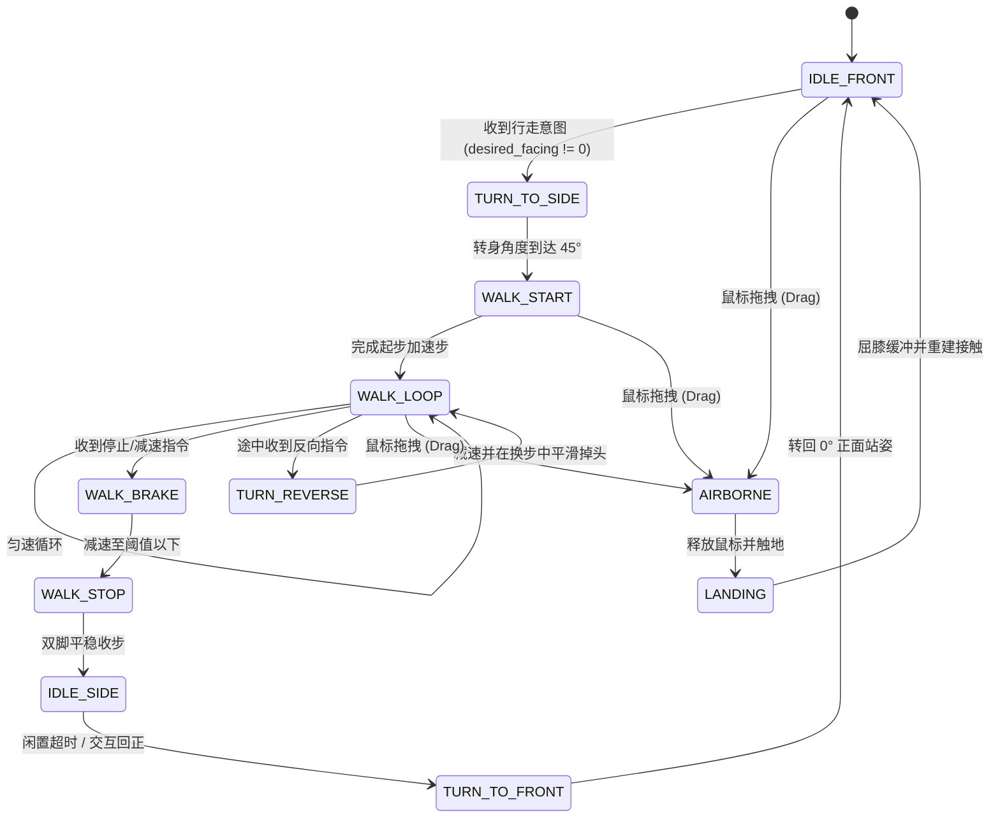

# ADULT 连续视角与步态计算核开发需求与技术规范（GLM / DeepSeek 接手专卷）

**编制日期**：2026-09-25  
**状态**：待实现 / 算法与架构设计完成  
**交接对象**：GLM / DeepSeek  
**前置参考**：[`docs/ADULT连续视角与横向行走执行计划-2026-09-25.md`](file:///d:/Desktop-Pet/docs/ADULT连续视角与横向行走执行计划-2026-09-25.md)  
**基线数据包**：[`assets/rig_adult_turn_v1/baseline/`](file:///d:/Desktop-Pet/assets/rig_adult_turn_v1/baseline/) 及 [`assets/rig_adult_turn_v1/baseline.json`](file:///d:/Desktop-Pet/assets/rig_adult_turn_v1/baseline.json)

---

## 1. 任务背景与工程职责划分

### 1.1 项目目标
为桌面宠物（Desktop-Pet）ADULT 阶段角色实现高质量的**连续视角平滑转身**（0° 正面 $\leftrightarrow$ 20° 半侧面 $\leftrightarrow$ 45° 侧走朝向）与**自然横向行走步态系统**（左右横向行走、起步、稳态、急停、反向折返、拖拽下落打断与落地复位）。

### 1.2 团队分工与接手范围
- **Antigravity（已有工作与后续负责）**：
  1. 完成 G0 基线冻结与数据隔离（`assets/rig_adult_turn_v1/`，确保不污染正式资产）。
  2. 搭建 ComfyUI AI 多视角参考图生成工具（`tools/generate_adult_turn_views.py`），生成候选图并组织美术图层拆分。
  3. 最终集成、性能打卡与视觉复核。
- **GLM / DeepSeek（当前接手核心）**：
  负责**所有涉及复杂软件架构、几何变换、矩阵运算与运动学生成的算法核心与代码实现**。具体涵盖：
  - **模块 1**：接触约束与双骨闭合解析 IK 步态引擎（`pet/rig/gait.py`）。
  - **模块 2**：连续视角共用拓扑配准、动态绑定矩阵与关键形态插值（`tools/build_adult_view_keyforms.py` 及 `pet/rig/skinned_mesh_item.py` 扩展）。
  - **模块 3**：高低频时钟解耦、变 $\Delta t$ 相位积分与原子帧提交协议（`pet/rig/presenter.py` 协同接口）。
  - **测试套件**：编写高覆盖率的数学与状态机单元测试（`spikes/test_adult_turn_gait.py`）。

---

## 2. 系统坐标系规范与正反向数学流水线

系统内涉及 5 级严格的坐标空间转换，开发时必须保持绝对的符号与方向一致：

```
[Local Bone Space] 
      │ 骨骼层级 FK (乘以前驱矩阵)
      ▼
[Canvas Rig Space] (960 × 1696, x 向右+, y 向下+)
      │ 顶点 LBS 蒙皮 (Bone Transforms & Dynamic Inverse Bind)
      ▼
[Skinned Mesh Space] (960 × 1696)
      │ 窗口视口投影 (缩放 S = H_win / 1696, 地面垂直偏移 ground_shift)
      ▼
[Logical Window Space] (宽 W_win, 高 H_win，默认 256 尺度)
      │ 桌面窗口位移 (加上窗口在操作系统桌面的绝对位置 X_win, Y_win)
      ▼
[Desktop World Space] (屏幕绝对物理/逻辑像素)
```

### 2.1 正向投影链条公式
设顶点在基准画布网格中的局部坐标为 $\mathbf{p}_v = \begin{bmatrix} x_v \\ y_v \\ 1 \end{bmatrix}$，骨骼索引为 $b_{v,k}$，对应权重为 $w_{v,k}$（$\sum_{k=0}^3 w_{v,k} = 1$）。

在连续视角 $\theta$（弧度）与姿态骨骼角增量 $\mathbf{q}$ 下，蒙皮后的画布坐标 $\mathbf{p}'_v$ 为：
$$\mathbf{p}'_v(\theta, \mathbf{q}) = \sum_{k=0}^3 w_{v,k} \cdot \mathbf{M}_{b_{v,k}}(\theta, \mathbf{q}) \cdot \mathbf{B}_{b_{v,k}}(\theta)^{-1} \cdot \mathbf{p}_v(\theta)$$

其中：
- $\mathbf{p}_v(\theta)$：随视角 $\theta$ 形变后的顶点基准坐标。
- $\mathbf{B}_b(\theta)$：该视角下骨骼 $b$ 的静态绑定世界矩阵（Dynamic Bind Pose）。
- $\mathbf{M}_b(\theta, \mathbf{q})$：骨骼当前世界矩阵（累积了局部旋转与平移 $\mathbf{q}$）。

经过窗口缩放 $S = \frac{H_{\text{win}}}{1696.0}$（256 高度下 $S \approx 0.150943$）与垂直地面偏移量 $Y_{\text{ground\_shift}} = 44.0$，投射到桌面世界坐标 $\mathbf{X}_{\text{world}} = \begin{bmatrix} X_w \\ Y_w \end{bmatrix}$：
$$\mathbf{X}_{\text{world}}(t) = \begin{bmatrix} X_{\text{win}}(t) \\ Y_{\text{win}}(t) \end{bmatrix} + S \cdot \begin{bmatrix} x'_v(t) - X_{\text{origin}} \\ y'_v(t) - Y_{\text{origin}} \end{bmatrix} + \begin{bmatrix} 0 \\ Y_{\text{ground\_shift}} \end{bmatrix}$$

### 2.2 逆向接触位移补偿推导（零滑步基础）
在支撑相期间，接触足的世界坐标必须恒定（$\frac{d \mathbf{X}_{\text{world}}}{dt} = \mathbf{0}$）。当桌面窗口以速度 $\mathbf{V}_{\text{win}}(t) = \begin{bmatrix} \dot{X}_{\text{win}} \\ \dot{Y}_{\text{win}} \end{bmatrix}$ 移动时，要求骨骼接触足在画布空间内的代数移动速度必须精确满足：
$$\dot{\mathbf{x}}'_{\text{contact}}(t) = -\frac{1}{S} \cdot \mathbf{V}_{\text{win}}(t)$$
即窗口向右走 1 个逻辑像素，角色在 256 尺度画布上的脚必须向后退 $\frac{1}{0.150943} \approx 6.625$ 像素。

---

## 3. 模块 1：接触锁定与解析双骨 IK 步态引擎（`pet/rig/gait.py`）

这是本任务的核心算法模块，包含 5 个关键数学子模块：

### 3.1 闭式解析 2-Bone 平面 IK 求解器（Closed-form Planar 2-Bone IK）
用于解算大腿（Thigh）、小腿（Shin）到脚踝（Ankle）的目标旋转，避免数值迭代带来的发散、开销与多解跳跃。

#### 数学定义：
- 髋关节坐标 $\mathbf{H} = (x_h, y_h)$，大腿长 $L_1 = \|\mathbf{K}_{\text{rest}} - \mathbf{H}_{\text{rest}}\|$。
- 目标脚踝坐标 $\mathbf{A} = (x_a, y_a)$，小腿长 $L_2 = \|\mathbf{A}_{\text{rest}} - \mathbf{K}_{\text{rest}}\|$。
- 髋踝距离 $D = \|\mathbf{A} - \mathbf{H}\| = \sqrt{(x_a - x_h)^2 + (y_a - y_h)^2}$。
- 膝关节弯曲偏置方向 $\sigma_{\text{bend}} \in \{+1, -1\}$（对于侧视行走，人型角色膝盖弯折方向受物理骨骼限位，成人模型下膝关节保持单向弯曲，禁止翻折）。

#### 求解步骤：
1. **奇异点软限制（Soft Reach Clamping）**：
   若 $D > L_1 + L_2 - \epsilon$（设定安全容差 $\epsilon = 0.5\text{ px}$），则发生过度拉伸，执行软收缩，计算虚拟可达目标 $\mathbf{A}_{\text{clamped}}$：
   $$D_{\text{clamped}} = (L_1 + L_2 - \epsilon) - d_0 \cdot \exp\left(-\frac{D - (L_1 + L_2 - \epsilon)}{d_0}\right)$$
   $$\mathbf{A}_{\text{clamped}} = \mathbf{H} + \frac{D_{\text{clamped}}}{D} (\mathbf{A} - \mathbf{H})$$
2. **余弦定理求内角**：
   $$\cos \beta = \text{clamp}\left( \frac{L_1^2 + L_2^2 - D^2}{2 L_1 L_2}, -1.0, 1.0 \right)$$
   $$\theta_{\text{knee}} = \pi - \arccos(\cos \beta)$$
   （根据局部骨骼轴向确定相对旋转符号，膝关节内角 $\beta \in [0, \pi]$，避免出现过伸钝角）。
3. **髋关节旋转角**：
   $$\cos \alpha = \text{clamp}\left( \frac{L_1^2 + D^2 - L_2^2}{2 L_1 D}, -1.0, 1.0 \right)$$
   $$\alpha = \arccos(\cos \alpha)$$
   $$\gamma = \text{atan2}(y_a - y_h, x_a - x_h)$$
   $$\theta_{\text{hip}} = \gamma + \sigma_{\text{bend}} \cdot \alpha - \theta_{\text{hip\_rest\_base}}$$
4. **脚踝方向逆补偿（Foot Orientation Lock）**：
   设当前足部目标全局仰角为 $\phi_{\text{target\_foot}}$，脚踝骨骼的局部旋转角必须满足：
   $$\theta_{\text{ankle}} = \phi_{\text{target\_foot}} - (\theta_{\text{hip}} + \theta_{\text{knee}} + \theta_{\text{pelvis}})$$
   **不变性检验**：脚掌着地时，$\phi_{\text{target\_foot}} \equiv 0^\circ$，足底线段在世界坐标中斜率绝对保持 0。

---

### 3.2 动态骨盆轨迹与下沉补偿（Pelvis Dip & Sway Path）
行走过程中，双脚张开时若骨盆高度固定不变，两腿可达半径不足，必将导致膝关节强行拉直并产生“抽搐”奇异点。必须动态解算骨盆高度。

#### 倒立双摆高度补偿公式：
在双足支撑与迈步循环中，根据双脚相对骨盆的水平跨度 $\Delta x_L = x_{\text{foot}, L} - x_{\text{pelvis}}$ 与 $\Delta x_R = x_{\text{foot}, R} - x_{\text{pelvis}}$，骨盆下沉高度 $\Delta Y_{\text{dip}}$ 必须满足：
$$Y_{\text{pelvis}}(\Phi) = Y_{\text{neutral}} + A_{\text{dip}} \cdot \sin^2(\pi \Phi)$$
其中：
- 振幅 $A_{\text{dip}}$ 由当前步长 $S_{\text{stride}}$ 动态诱导：
  $$A_{\text{dip}} = (L_1 + L_2) \cdot \left(1 - \cos\left(\arcsin\left(\frac{S_{\text{stride}}}{2(L_1 + L_2)}\right)\right)\right) + \delta_{\text{slack}}$$
  确保在最大迈步跨度时，支撑腿的伸展率保持在安全舒适区间（$88\% \sim 95\%$）。
- **横向重心摇摆（Lateral Sway）**：
  $$X_{\text{pelvis}}(\Phi) = X_{\text{neutral}} + A_{\text{sway}} \cdot \sin(2\pi \Phi)$$
  骨盆在水平方向上随支撑脚切换产生周期性侧向偏移（重心压向支撑脚）。

---

### 3.3 足底滚动三相接触模型（Foot-Roll Stance Phase & Bézier Swing）
真实两足动物步行中，脚底不是刚性平面贴地，而是经历“脚后跟 $\to$ 全脚掌 $\to$ 前脚掌”滚动。

```
       [Heel Strike]           [Flat Foot]           [Forefoot Roll]
       (后跟着地 -15°)         (全掌平贴 0°)          (前掌蹬地 +35°)
           \                      _______                 /
            \____                [_______]             __/
             • 接触点: Heel       • 接触点: Sole        • 接触点: Forefoot
```

设归一化相位 $\tau \in [0, 1)$：
1. **支撑相（Stance Phase, $\tau \in [0, 0.60]$）**：
   - $\tau \in [0, 0.15]$（Heel Strike）：锚定点为 $\mathbf{c}_{\text{heel}}$，世界坐标固定。足部角度由 $-15^\circ$ 平滑回正至 $0^\circ$。
   - $\tau \in [0.15, 0.45]$（Flat Foot）：锚定点转移至足底中心 $\mathbf{c}_{\text{sole}}$，足部角度锁定 $0^\circ$。
   - $\tau \in [0.45, 0.60]$（Forefoot Roll / Push-off）：锚定点转移至脚趾/前掌 $\mathbf{c}_{\text{forefoot}}$，世界坐标固定，足底绕前掌旋转，角度由 $0^\circ$ 增加至 $+35^\circ$。
2. **摆动相（Swing Phase, $\tau \in [0.60, 1.00]$）**：
   接触释放，脚部脱离地面，踝关节目标坐标由起跳点 $\mathbf{P}_0$ 经由三次贝塞尔曲线过渡到下一落地点 $\mathbf{P}_3$：
   $$\mathbf{P}(u) = (1-u)^3 \mathbf{P}_0 + 3(1-u)^2 u \mathbf{P}_1 + 3(1-u) u^2 \mathbf{P}_2 + u^3 \mathbf{P}_3 \quad (u = \frac{\tau - 0.6}{0.4})$$
   - 控制点 $\mathbf{P}_1, \mathbf{P}_2$ 提供抬脚高度（256 显示尺度下抬脚高度为 $3.5\text{--}5.0\text{ px}$），保证足尖离地间隙 $\ge 2.0\text{ px}$，杜绝穿地。
   - 终端速度条件：在 $u \to 1.0$ 时，垂直速度分量 $\frac{dY}{du} \to 0$，实现软着陆，避免踩地冲击抖动。

---

### 3.4 步频、步长与根位移自适应同步器（Gait Synchronizer）
系统必须支持变时间步长 $\Delta t$（如 30Hz、60Hz 甚至掉帧波动），不能依赖固定步进。

#### 核心约束方程：
$$v_{\text{walk}}(t) = f_{\text{stride}}(t) \cdot S_{\text{stride}}(t)$$
在给定行进速度 $v_{\text{walk}}$ 时（例如 256 尺度下配置为 $75\text{ px/s}$）：
- 步频初值设定为 $f = 1.25\text{ Hz}$（周期 $T = 0.8\text{ s}$）。
- 单步位移 $S_{\text{stride}} = \frac{v}{f} = \frac{75}{1.25} = 60\text{ px}$（窗口世界位移）。
- 相位推进积分：
  $$\Phi(t + \Delta t) = \left( \Phi(t) + f(t) \cdot \Delta t \right) \bmod 1.0$$
- 保证任意 $\Delta t$ 下积分累积误差与窗口物理位移严格相等，**单步累积滑移误差必须 $\le 0.5\text{ px}$**。

---

### 3.5 步态有限状态机拓扑（Gait FSM Architecture）



#### 关键转移与异常保护机制：
1. **转向中收到反向指令**：禁止硬重置或瞬时镜像；从当前姿态动态减速、摆动腿寻找新落点，完成平滑掉头。
2. **拖拽打断（Drag Interruption）**：立即无条件注销所有脚底世界接触锁定，状态重置为悬空漂浮姿态。
3. **落地复位（Landing Recovery）**：射线下测获取桌面水平线，执行 $0.15\text{ s}$ 屈膝下蹲缓冲，将双脚重新锚定在桌面上，再转入静止或行走。

---

## 4. 模块 2：连续视角共用拓扑与关键形态配准核

### 4.1 几何与拓扑不变性约束（Shared Topology Invariance）
不同视角（0°, 20°, 45°）严禁重新生成独立顶点的网格。必须满足：
1. **拓扑不变性**：各图层顶点总数 $N$、顶点 ID 顺序、三角面索引数组 $F \in \mathbb{N}^{M \times 3}$、骨骼绑定权重矩阵 $W \in \mathbb{R}^{N \times 4}$ 在所有视角下完全相同。
2. **网格非退化与有向面积恒正**：
   在视角区间 $\theta \in [0^\circ, 45^\circ]$ 均匀采样 101 点，每一个三角形面 $(v_a, v_b, v_c)$ 的有向面积行列式必须满足：
   $$\det \begin{bmatrix} x_a(\theta) & y_a(\theta) & 1 \\ x_b(\theta) & y_b(\theta) & 1 \\ x_c(\theta) & y_c(\theta) & 1 \end{bmatrix} \ge \epsilon_{\text{area}} > 0 \quad (\epsilon_{\text{area}} = 10^{-4})$$
   绝对禁止出现面片自相交、翻折或法线反向。

---

### 4.2 动态 2D 绑定姿态与逆矩阵自适应重算（Dynamic Bind Poses）

#### 核心问题：
在 2D 透视中，当角色转向侧面时，左/右肩、左/右髋关节在 2D 投影平面上的距离因为透视缩水（Foreshortening）而大幅改变。如果沿用 0° 正面时固定的逆绑定矩阵 $\mathbf{B}_b(0^\circ)^{-1}$，在 45° 姿态下施加任何骨骼微调都会导致极其严重的剪切撕裂。

#### 理论推导与零姿态恒等性定理（Zero-Delta Invariance Theorem）：
在视角 $\theta$ 下，骨骼 $b$ 的局部原点位置在投影平面投影为 $\mathbf{J}_b(\theta)$。
定义该视角下的静态绑定矩阵：
$$\mathbf{B}_b(\theta) = \prod_{k \in \text{anc}(b)} \mathbf{T}_{\text{local}, k}(\theta, \mathbf{q}=\mathbf{0})$$
**严格数学条件（零增量不变量）**：
当骨骼姿态旋转增量为零时（$\mathbf{q} = \mathbf{0}$），骨骼当前世界矩阵 $\mathbf{M}_b(\theta, \mathbf{0}) \equiv \mathbf{B}_b(\theta)$。
代入 LBS 蒙皮方程：
$$\mathbf{p}'_v(\theta, \mathbf{0}) = \sum_k w_{v,k} \cdot \mathbf{M}_{b_k}(\theta, \mathbf{0}) \cdot \mathbf{B}_{b_k}(\theta)^{-1} \cdot \mathbf{p}_v(\theta) = \sum_k w_{v,k} \cdot \mathbf{B}_{b_k}(\theta) \cdot \mathbf{B}_{b_k}(\theta)^{-1} \cdot \mathbf{p}_v(\theta) \equiv \mathbf{p}_v(\theta)$$
**验收准则**：在任意视角 $\theta \in [-45^\circ, +45^\circ]$ 下，当 $\mathbf{q} = \mathbf{0}$ 时，蒙皮后顶点坐标与关键形态输入坐标的全局最大绝对误差必须满足：
$$\max_{v} \|\mathbf{p}'_v(\theta, \mathbf{0}) - \mathbf{p}_v(\theta)\|_\infty \le 10^{-6}\text{ px}$$

---

### 4.3 视角关键帧三次 Hermite 样条插值
对于中间连续视角 $\theta \in (0^\circ, 20^\circ) \cup (20^\circ, 45^\circ)$，顶点基准坐标 $\mathbf{p}_v(\theta)$ 与骨骼基准位置使用带切线平滑的三次 Hermite 样条插值：
$$\mathbf{p}(\mu) = (2\mu^3 - 3\mu^2 + 1)\mathbf{P}_0 + (\mu^3 - 2\mu^2 + \mu)\mathbf{m}_0 + (-2\mu^3 + 3\mu^2)\mathbf{P}_1 + (\mu^3 - \mu^2)\mathbf{m}_1$$
- 保证一阶导数连续（$C^1$ 连续性），角速度跃度 $\le 0.2\text{ px/rad}$，杜绝视角过渡时的折角或顿挫感。

---

### 4.4 遮挡补片与动态透明度融合（Patch Occlusion Blending）
在 45° 视角下新显露的区域（例如远侧肩袖、裙侧剪裁、发束背面），通过伴生补片图层显露。补片的透明度遵循余弦加权平滑阶跃函数：
$$\alpha_{\text{patch}}(\theta) = \begin{cases} 0, & \theta < \theta_0 \\ \frac{1}{2} \left(1 - \cos\left(\pi \frac{\theta - \theta_0}{\theta_1 - \theta_0}\right)\right), & \theta_0 \le \theta \le \theta_1 \\ 1, & \theta > \theta_1 \end{cases}$$
确保新图层由完全透明平滑融入，禁止图层深度（Z-Order）瞬时闪现跳变。

---

## 5. 模块 3：主循环时间解耦与原子提交协议

### 5.1 帧率与时间解耦机制
- 坚决摒弃固定推进 $33\text{ ms}$ 的旧模式，使用高精度单调时钟 `time.perf_counter()` 计算实际 $\Delta t$。
- 相位积分采用带上限的自适应分步（Sub-stepping，当 $\Delta t > 0.05\text{ s}$ 时分多次微积分，防止掉帧穿墙）。

### 5.2 窗口位移与姿态原子提交
为了保证零滑步，操作系统窗口移动指令与 QML 场景图姿态更新必须在同一个 Qt 渲染 Tick 内原子生效：
```python
# 必须使用同一个时间戳与位移差值同步提交
def tick(self, dt: float, desired_vx: float):
    # 1. 步态求解器计算出本帧窗口应当位移量与骨骼姿态
    delta_x_win, rig_pose, foot_contacts = self.gait_solver.step(dt, desired_vx)
    
    # 2. 统一更新窗口全局坐标
    if delta_x_win != 0:
        self.window.setX(self.window.x() + delta_x_win)
        
    # 3. 统一将骨骼数据传入蒙皮渲染项 (同一帧提交，严禁跨帧延迟)
    self.skinned_item.update_pose(rig_pose, self.gait_solver.current_view_yaw)
```

---

## 6. 代码接口规范与数据契约定义

GLM / DeepSeek 在实现时必须严格遵循以下类签名与数据结构：

### 6.1 `pet/rig/gait.py` 核心接口签名

```python
"""
pet/rig/gait.py - Bipedal Gait Solver with Contact-Locked Analytical IK
"""
from dataclasses import dataclass, field
from enum import Enum
from typing import Dict, List, Optional, Tuple
import numpy as np

class GaitPhaseState(Enum):
    IDLE_FRONT = "idle_front"
    TURN_TO_SIDE = "turn_to_side"
    WALK_START = "walk_start"
    WALK_LOOP = "walk_loop"
    WALK_BRAKE = "walk_brake"
    WALK_STOP = "walk_stop"
    TURN_TO_FRONT = "turn_to_front"
    AIRBORNE = "airborne"
    LANDING = "landing"

class ContactType(Enum):
    NONE = 0
    HEEL = 1
    FLAT_SOLE = 2
    FOREFOOT = 3

@dataclass
class FootContactLock:
    is_locked: bool = False
    contact_type: ContactType = ContactType.NONE
    world_anchor_x: float = 0.0
    world_anchor_y: float = 0.0
    initial_canvas_x: float = 0.0
    initial_canvas_y: float = 0.0

@dataclass
class GaitOutputs:
    delta_window_x: float                        # 驱动窗口的世界位移 (px)
    view_yaw: float                              # 当前视角角度 (0.0 ~ 45.0 度)
    pelvis_offset: Tuple[float, float]           # 骨盆位移 (dx, dy)
    bone_rotations: Dict[str, float]             # 各骨骼局部旋转增量 (弧度)
    left_foot_contact: ContactType               # 左脚接触状态
    right_foot_contact: ContactType              # 右脚接触状态
    foot_slide_drift_px: float                   # 当前帧接触点世界漂移量 (用于 QA 监测)

class Analytical2BoneIK:
    @staticmethod
    def solve(
        hip: np.ndarray,                         # [x, y]
        target_ankle: np.ndarray,                # [x, y]
        l1: float,                               # 大腿长度
        l2: float,                               # 小腿长度
        bend_direction: int = 1,                 # 膝关节弯曲方向 (+1 或 -1)
        target_foot_angle: float = 0.0           # 目标脚底绝对仰角 (rad)
    ) -> Tuple[float, float, float]:
        """
        闭式解析 2-Bone 平面 IK 求解器
        返回: (hip_angle_rad, knee_angle_rad, ankle_angle_rad)
        """
        ...

class GaitSolver:
    def __init__(self, spec_data: dict, window_scale: float = 0.150943):
        self.scale = window_scale
        self.state = GaitPhaseState.IDLE_FRONT
        self.view_yaw = 0.0
        self.phase = 0.0
        self.left_contact = FootContactLock()
        self.right_contact = FootContactLock()
        ...

    def update(
        self,
        dt: float,                               # 实际流逝时间 (秒)
        desired_velocity_x: float,               # 期望速度 (px/s)
        current_window_pos: Tuple[int, int],     # (win_x, win_y)
        is_grounded: bool = True,                # 是否触地
        is_dragged: bool = False                 # 是否被用户鼠标拖拽
    ) -> GaitOutputs:
        """主步态求解更新入口"""
        ...
```

---

### 6.2 `mesh/view_keyforms.json` 数据结构规范

```json
{
  "version": "1.0",
  "views": {
    "front": { "yaw_deg": 0.0, "weight_file": "mesh/mesh_data.json" },
    "right20": { "yaw_deg": 20.0 },
    "right45": { "yaw_deg": 45.0 }
  },
  "bones_dynamic_bind": {
    "right45": {
      "pelvis": { "pivot": [480.0, 848.0], "world_matrix": [1.0, 0.0, 0.0, 1.0, 0.0, 0.0] },
      "thigh_l": { "pivot": [458.2, 915.0], "world_matrix": [...] },
      "thigh_r": { "pivot": [502.1, 915.0], "world_matrix": [...] }
    }
  },
  "layers_keyforms": {
    "head_base": {
      "vertex_count": 64,
      "positions": {
        "front": [[100.2, 200.5], "..."],
        "right20": [[95.1, 201.0], "..."],
        "right45": [[88.0, 203.2], "..."]
      }
    }
  },
  "occlusion_patches": [
    {
      "patch_id": "patch_shoulder_far_r",
      "base_layer": "arm_r",
      "visible_yaw_range": [15.0, 45.0],
      "blend_curve": "cosine"
    }
  ]
}
```

---

## 7. 验收门槛与单元测试断言标准

GLM / DeepSeek 实现完成后，必须通过以下自动化单元测试断言（将在 `spikes/test_adult_turn_gait.py` 中执行）：

| 测试项 | 物理量 / 指标 | 硬性通过门槛 | 测量与断言方式 |
| :--- | :--- | :--- | :--- |
| **零姿态恒等性** | 蒙皮网格零偏置误差 | $\le 10^{-6}\text{ px}$ | $\max_v \|\mathbf{p}'_v(\theta, \mathbf{0}) - \mathbf{p}_v(\theta)\|_\infty < 1e-6$ |
| **网格非退化性** | 101 点采样三角面有向面积 | $\min \det(\Delta) > 10^{-4}$ | 遍历 21 层所有三角形在所有插值点，无反转 |
| **世界空间零滑步** | 单次支撑相世界位移漂移 | $\le 0.5\text{ px}$ | 跟踪锚定脚顶点的绝对世界坐标，累积位移 $\le 0.5$ |
| **穿地抑制** | 足底对地面水平线穿透 | $\le 0.5\text{ px}$ | 支撑相期间所有足底顶点 $Y_w \le Y_{\text{ground}} + 0.5$ |
| **膝关节解算稳定性** | 2-Bone IK 奇异点过渡 | 无 NaN，无角度突变 | 相邻帧膝关节角速度 $|\dot{\theta}_{\text{knee}}| \le 20\text{ rad/s}$ |
| **时间步长一致性** | 30Hz vs 60Hz 轨迹差异 | 累积误差 $\le 1.0\text{ px}$ | 相同物理时间下两种离散积分步长终点位置比对 |
| **打断与恢复** | 拖拽打断后重新落地回位 | 100% 成功重建接触 | 模拟任意相位注入 `is_dragged=True` 后恢复落地 |

---

## 8. GLM / DeepSeek 立即上手建议步骤
1. **核对基线**：读取 [`assets/rig_adult_turn_v1/baseline.json`](file:///d:/Desktop-Pet/assets/rig_adult_turn_v1/baseline.json) 与当前已通过的测试 [`spikes/test_skinned_mesh_adult.py`](file:///d:/Desktop-Pet/spikes/test_skinned_mesh_adult.py)。
2. **编写计算核**：创建 [`pet/rig/gait.py`](file:///d:/Desktop-Pet/pet/rig/gait.py)，优先实现 `Analytical2BoneIK` 与带足底锁定的 `GaitSolver`。
3. **编写单元测试**：创建 [`spikes/test_adult_turn_gait.py`](file:///d:/Desktop-Pet/spikes/test_adult_turn_gait.py)，对照第 7 节的门槛进行严密断言验证。
4. **扩展绑定与蒙皮**：实现 `tools/build_adult_view_keyforms.py`，扩展 `pet/rig/skinned_mesh_item.py` 的动态绑定矩阵更新。
